# Introduction

DDSAnalytics, an analytics company that specializes in talent management solutions for Fortune 1000 companies, is launching a product designed to predict employee turnover. They asked us for help in identifying the key factors leading to attrition. They provided us with an existing dataset of employee data, and we performed an exploratory data analysis to determine what factors are associated with attrition.

# What factors are statistically significant for attrition?

To test this, we ran two-sample t-tests for each factor against attrition. We created dummy variables for each categorical variable so we could test each value separately. Note that we did not include an adjustment for multiple comparisons.


```r
# Read in the data and adjust classes
library("openxlsx")
workers <- read.xlsx("CaseStudy2-data.xlsx")
workers$Attrition <- as.factor(workers$Attrition)
workers$BusinessTravel <- as.factor(workers$BusinessTravel)
workers$Department <- as.factor(workers$Department)
workers$EducationField <- as.factor(workers$EducationField)
workers$Gender <- as.factor(workers$Gender)
workers$JobRole <- as.factor(workers$JobRole)
workers$Over18 <- as.factor(workers$Over18)
workers$OverTime <- as.factor(workers$OverTime)
workers$JobRole <- as.factor(workers$JobRole)
workers$JobRole <- as.factor(workers$JobRole)
workers$MaritalStatus <- as.factor(workers$MaritalStatus)
# Remove "Over18", "StandardHours", "EmployeeID", and "EmployeeCount" as they are not useful
workers <- workers[,c(-9,-10,-22,-27)]
# Create dummy variables
businesstravel <- model.matrix(~0+BusinessTravel, data = workers)
department <- model.matrix(~0+Department, data = workers)
educationfield <- model.matrix(~0+EducationField, data = workers)
gender <- model.matrix(~0+Gender, data = workers)
jobrole <- model.matrix(~0+JobRole, data = workers)
maritalstatus <- model.matrix(~0+MaritalStatus, data = workers)
overtime <- model.matrix(~0+OverTime, data = workers)
workers <- data.frame(workers, businesstravel, department, educationfield, gender, jobrole, maritalstatus, overtime)
# Run t-test for each variable on attrition
for (i in c(1, 4, 6:7, 9, 11:13, 15, 17:19, 21:59)) {
  print(names(workers)[i])
  print(t.test(workers[,i] ~ Attrition, data = workers))
}
```

```
## [1] "Age"
## 
## 	Welch Two Sample t-test
## 
## data:  workers[, i] by Attrition
## t = 5.828, df = 316.93, p-value = 1.38e-08
## alternative hypothesis: true difference in means is not equal to 0
## 95 percent confidence interval:
##  2.618930 5.288346
## sample estimates:
##  mean in group No mean in group Yes 
##          37.56123          33.60759 
## 
## [1] "DailyRate"
## 
## 	Welch Two Sample t-test
## 
## data:  workers[, i] by Attrition
## t = 2.1789, df = 333.76, p-value = 0.03004
## alternative hypothesis: true difference in means is not equal to 0
## 95 percent confidence interval:
##    6.040083 118.243100
## sample estimates:
##  mean in group No mean in group Yes 
##          812.5045          750.3629 
## 
## [1] "DistanceFromHome"
## 
## 	Welch Two Sample t-test
## 
## data:  workers[, i] by Attrition
## t = -2.8882, df = 322.72, p-value = 0.004137
## alternative hypothesis: true difference in means is not equal to 0
## 95 percent confidence interval:
##  -2.8870025 -0.5475146
## sample estimates:
##  mean in group No mean in group Yes 
##          8.915653         10.632911 
## 
## [1] "Education"
## 
## 	Welch Two Sample t-test
## 
## data:  workers[, i] by Attrition
## t = 1.2177, df = 336.95, p-value = 0.2242
## alternative hypothesis: true difference in means is not equal to 0
## 95 percent confidence interval:
##  -0.05374319  0.22843290
## sample estimates:
##  mean in group No mean in group Yes 
##          2.927007          2.839662 
## 
## [1] "EnvironmentSatisfaction"
## 
## 	Welch Two Sample t-test
## 
## data:  workers[, i] by Attrition
## t = 3.7513, df = 316.62, p-value = 0.0002092
## alternative hypothesis: true difference in means is not equal to 0
## 95 percent confidence interval:
##  0.146056 0.468253
## sample estimates:
##  mean in group No mean in group Yes 
##          2.771290          2.464135 
## 
## [1] "HourlyRate"
## 
## 	Welch Two Sample t-test
## 
## data:  workers[, i] by Attrition
## t = 0.26477, df = 335.98, p-value = 0.7914
## alternative hypothesis: true difference in means is not equal to 0
## 95 percent confidence interval:
##  -2.432272  3.188891
## sample estimates:
##  mean in group No mean in group Yes 
##          65.95215          65.57384 
## 
## [1] "JobInvolvement"
## 
## 	Welch Two Sample t-test
## 
## data:  workers[, i] by Attrition
## t = 4.6602, df = 312.81, p-value = 4.681e-06
## alternative hypothesis: true difference in means is not equal to 0
## 95 percent confidence interval:
##  0.1453097 0.3576727
## sample estimates:
##  mean in group No mean in group Yes 
##          2.770479          2.518987 
## 
## [1] "JobLevel"
## 
## 	Welch Two Sample t-test
## 
## data:  workers[, i] by Attrition
## t = 7.3859, df = 376.25, p-value = 9.845e-13
## alternative hypothesis: true difference in means is not equal to 0
## 95 percent confidence interval:
##  0.3733861 0.6443231
## sample estimates:
##  mean in group No mean in group Yes 
##          2.145985          1.637131 
## 
## [1] "JobSatisfaction"
## 
## 	Welch Two Sample t-test
## 
## data:  workers[, i] by Attrition
## t = 3.9261, df = 328.59, p-value = 0.0001052
## alternative hypothesis: true difference in means is not equal to 0
## 95 percent confidence interval:
##  0.1547890 0.4656797
## sample estimates:
##  mean in group No mean in group Yes 
##          2.778589          2.468354 
## 
## [1] "MonthlyIncome"
## 
## 	Welch Two Sample t-test
## 
## data:  workers[, i] by Attrition
## t = 7.4826, df = 412.74, p-value = 4.434e-13
## alternative hypothesis: true difference in means is not equal to 0
## 95 percent confidence interval:
##  1508.244 2583.050
## sample estimates:
##  mean in group No mean in group Yes 
##          6832.740          4787.093 
## 
## [1] "MonthlyRate"
## 
## 	Welch Two Sample t-test
## 
## data:  workers[, i] by Attrition
## t = -0.5755, df = 330.1, p-value = 0.5653
## alternative hypothesis: true difference in means is not equal to 0
## 95 percent confidence interval:
##  -1296.8656   709.8084
## sample estimates:
##  mean in group No mean in group Yes 
##          14265.78          14559.31 
## 
## [1] "NumCompaniesWorked"
## 
## 	Welch Two Sample t-test
## 
## data:  workers[, i] by Attrition
## t = -1.5747, df = 317.14, p-value = 0.1163
## alternative hypothesis: true difference in means is not equal to 0
## 95 percent confidence interval:
##  -0.66437603  0.07367926
## sample estimates:
##  mean in group No mean in group Yes 
##          2.645580          2.940928 
## 
## [1] "PercentSalaryHike"
## 
## 	Welch Two Sample t-test
## 
## data:  workers[, i] by Attrition
## t = 0.50424, df = 326.11, p-value = 0.6144
## alternative hypothesis: true difference in means is not equal to 0
## 95 percent confidence interval:
##  -0.3890709  0.6572652
## sample estimates:
##  mean in group No mean in group Yes 
##          15.23114          15.09705 
## 
## [1] "PerformanceRating"
## 
## 	Welch Two Sample t-test
## 
## data:  workers[, i] by Attrition
## t = -0.10999, df = 331.22, p-value = 0.9125
## alternative hypothesis: true difference in means is not equal to 0
## 95 percent confidence interval:
##  -0.05350780  0.04784086
## sample estimates:
##  mean in group No mean in group Yes 
##          3.153285          3.156118 
## 
## [1] "RelationshipSatisfaction"
## 
## 	Welch Two Sample t-test
## 
## data:  workers[, i] by Attrition
## t = 1.7019, df = 323.54, p-value = 0.08973
## alternative hypothesis: true difference in means is not equal to 0
## 95 percent confidence interval:
##  -0.02102367  0.29067575
## sample estimates:
##  mean in group No mean in group Yes 
##          2.733982          2.599156 
## 
## [1] "StockOptionLevel"
## 
## 	Welch Two Sample t-test
## 
## data:  workers[, i] by Attrition
## t = 5.2442, df = 329.67, p-value = 2.812e-07
## alternative hypothesis: true difference in means is not equal to 0
## 95 percent confidence interval:
##  0.1985054 0.4368288
## sample estimates:
##  mean in group No mean in group Yes 
##         0.8450933         0.5274262 
## 
## [1] "TotalWorkingYears"
## 
## 	Welch Two Sample t-test
## 
## data:  workers[, i] by Attrition
## t = 7.0192, df = 350.88, p-value = 1.16e-11
## alternative hypothesis: true difference in means is not equal to 0
## 95 percent confidence interval:
##  2.604401 4.632019
## sample estimates:
##  mean in group No mean in group Yes 
##         11.862936          8.244726 
## 
## [1] "TrainingTimesLastYear"
## 
## 	Welch Two Sample t-test
## 
## data:  workers[, i] by Attrition
## t = 2.3305, df = 339.56, p-value = 0.02036
## alternative hypothesis: true difference in means is not equal to 0
## 95 percent confidence interval:
##  0.03251776 0.38439273
## sample estimates:
##  mean in group No mean in group Yes 
##          2.832928          2.624473 
## 
## [1] "WorkLifeBalance"
## 
## 	Welch Two Sample t-test
## 
## data:  workers[, i] by Attrition
## t = 2.1742, df = 302.49, p-value = 0.03047
## alternative hypothesis: true difference in means is not equal to 0
## 95 percent confidence interval:
##  0.01165453 0.23393357
## sample estimates:
##  mean in group No mean in group Yes 
##          2.781022          2.658228 
## 
## [1] "YearsAtCompany"
## 
## 	Welch Two Sample t-test
## 
## data:  workers[, i] by Attrition
## t = 5.2826, df = 338.21, p-value = 2.286e-07
## alternative hypothesis: true difference in means is not equal to 0
## 95 percent confidence interval:
##  1.404805 3.071629
## sample estimates:
##  mean in group No mean in group Yes 
##          7.369019          5.130802 
## 
## [1] "YearsInCurrentRole"
## 
## 	Welch Two Sample t-test
## 
## data:  workers[, i] by Attrition
## t = 6.8471, df = 366.57, p-value = 3.187e-11
## alternative hypothesis: true difference in means is not equal to 0
## 95 percent confidence interval:
##  1.127107 2.035355
## sample estimates:
##  mean in group No mean in group Yes 
##          4.484185          2.902954 
## 
## [1] "YearsSinceLastPromotion"
## 
## 	Welch Two Sample t-test
## 
## data:  workers[, i] by Attrition
## t = 1.2879, df = 338.49, p-value = 0.1987
## alternative hypothesis: true difference in means is not equal to 0
## 95 percent confidence interval:
##  -0.1525043  0.7309843
## sample estimates:
##  mean in group No mean in group Yes 
##          2.234388          1.945148 
## 
## [1] "YearsWithCurrManager"
## 
## 	Welch Two Sample t-test
## 
## data:  workers[, i] by Attrition
## t = 6.6334, df = 365.1, p-value = 1.185e-10
## alternative hypothesis: true difference in means is not equal to 0
## 95 percent confidence interval:
##  1.065929 1.964223
## sample estimates:
##  mean in group No mean in group Yes 
##          4.367397          2.852321 
## 
## [1] "BusinessTravelNon.Travel"
## 
## 	Welch Two Sample t-test
## 
## data:  workers[, i] by Attrition
## t = 3.6345, df = 446.56, p-value = 0.0003109
## alternative hypothesis: true difference in means is not equal to 0
## 95 percent confidence interval:
##  0.02814850 0.09442996
## sample estimates:
##  mean in group No mean in group Yes 
##        0.11192214        0.05063291 
## 
## [1] "BusinessTravelTravel_Frequently"
## 
## 	Welch Two Sample t-test
## 
## data:  workers[, i] by Attrition
## t = -3.8949, df = 300.46, p-value = 0.0001211
## alternative hypothesis: true difference in means is not equal to 0
## 95 percent confidence interval:
##  -0.1843103 -0.0605797
## sample estimates:
##  mean in group No mean in group Yes 
##         0.1686942         0.2911392 
## 
## [1] "BusinessTravelTravel_Rarely"
## 
## 	Welch Two Sample t-test
## 
## data:  workers[, i] by Attrition
## t = 1.8298, df = 322.28, p-value = 0.06821
## alternative hypothesis: true difference in means is not equal to 0
## 95 percent confidence interval:
##  -0.004598931  0.126910469
## sample estimates:
##  mean in group No mean in group Yes 
##         0.7193836         0.6582278 
## 
## [1] "DepartmentHuman.Resources"
## 
## 	Welch Two Sample t-test
## 
## data:  workers[, i] by Attrition
## t = -0.60362, df = 314.97, p-value = 0.5465
## alternative hypothesis: true difference in means is not equal to 0
## 95 percent confidence interval:
##  -0.03948760  0.02094684
## sample estimates:
##  mean in group No mean in group Yes 
##        0.04136253        0.05063291 
## 
## [1] "DepartmentResearch...Development"
## 
## 	Welch Two Sample t-test
## 
## data:  workers[, i] by Attrition
## t = 3.1561, df = 322.12, p-value = 0.00175
## alternative hypothesis: true difference in means is not equal to 0
## 95 percent confidence interval:
##  0.04156424 0.17913858
## sample estimates:
##  mean in group No mean in group Yes 
##         0.6715328         0.5611814 
## 
## [1] "DepartmentSales"
## 
## 	Welch Two Sample t-test
## 
## data:  workers[, i] by Attrition
## t = -2.952, df = 318.69, p-value = 0.003392
## alternative hypothesis: true difference in means is not equal to 0
## 95 percent confidence interval:
##  -0.16844892 -0.03371314
## sample estimates:
##  mean in group No mean in group Yes 
##         0.2871046         0.3881857 
## 
## [1] "EducationFieldHuman.Resources"
## 
## 	Welch Two Sample t-test
## 
## data:  workers[, i] by Attrition
## t = -1.1485, df = 288.39, p-value = 0.2517
## alternative hypothesis: true difference in means is not equal to 0
## 95 percent confidence interval:
##  -0.036133764  0.009503234
## sample estimates:
##  mean in group No mean in group Yes 
##        0.01622060        0.02953586 
## 
## [1] "EducationFieldLife.Sciences"
## 
## 	Welch Two Sample t-test
## 
## data:  workers[, i] by Attrition
## t = 1.2683, df = 336.66, p-value = 0.2056
## alternative hypothesis: true difference in means is not equal to 0
## 95 percent confidence interval:
##  -0.02411779  0.11166797
## sample estimates:
##  mean in group No mean in group Yes 
##         0.4193025         0.3755274 
## 
## [1] "EducationFieldMarketing"
## 
## 	Welch Two Sample t-test
## 
## data:  workers[, i] by Attrition
## t = -1.9126, df = 304.34, p-value = 0.05674
## alternative hypothesis: true difference in means is not equal to 0
## 95 percent confidence interval:
##  -0.095583507  0.001360299
## sample estimates:
##  mean in group No mean in group Yes 
##         0.1005677         0.1476793 
## 
## [1] "EducationFieldMedical"
## 
## 	Welch Two Sample t-test
## 
## data:  workers[, i] by Attrition
## t = 1.8736, df = 345.55, p-value = 0.06182
## alternative hypothesis: true difference in means is not equal to 0
## 95 percent confidence interval:
##  -0.002954913  0.121755410
## sample estimates:
##  mean in group No mean in group Yes 
##         0.3252230         0.2658228 
## 
## [1] "EducationFieldOther"
## 
## 	Welch Two Sample t-test
## 
## data:  workers[, i] by Attrition
## t = 0.73397, df = 356.12, p-value = 0.4634
## alternative hypothesis: true difference in means is not equal to 0
## 95 percent confidence interval:
##  -0.01875882  0.04109807
## sample estimates:
##  mean in group No mean in group Yes 
##        0.05758313        0.04641350 
## 
## [1] "EducationFieldTechnical.Degree"
## 
## 	Welch Two Sample t-test
## 
## data:  workers[, i] by Attrition
## t = -2.2879, df = 296.37, p-value = 0.02285
## alternative hypothesis: true difference in means is not equal to 0
## 95 percent confidence interval:
##  -0.100296396 -0.007539797
## sample estimates:
##  mean in group No mean in group Yes 
##         0.0811030         0.1350211 
## 
## [1] "GenderFemale"
## 
## 	Welch Two Sample t-test
## 
## data:  workers[, i] by Attrition
## t = 1.1421, df = 336.66, p-value = 0.2542
## alternative hypothesis: true difference in means is not equal to 0
## 95 percent confidence interval:
##  -0.02834014  0.10681499
## sample estimates:
##  mean in group No mean in group Yes 
##         0.4063260         0.3670886 
## 
## [1] "GenderMale"
## 
## 	Welch Two Sample t-test
## 
## data:  workers[, i] by Attrition
## t = -1.1421, df = 336.66, p-value = 0.2542
## alternative hypothesis: true difference in means is not equal to 0
## 95 percent confidence interval:
##  -0.10681499  0.02834014
## sample estimates:
##  mean in group No mean in group Yes 
##         0.5936740         0.6329114 
## 
## [1] "JobRoleHealthcare.Representative"
## 
## 	Welch Two Sample t-test
## 
## data:  workers[, i] by Attrition
## t = 4.0453, df = 487.81, p-value = 6.074e-05
## alternative hypothesis: true difference in means is not equal to 0
## 95 percent confidence interval:
##  0.03135690 0.09058506
## sample estimates:
##  mean in group No mean in group Yes 
##        0.09894566        0.03797468 
## 
## [1] "JobRoleHuman.Resources"
## 
## 	Welch Two Sample t-test
## 
## data:  workers[, i] by Attrition
## t = -1.2017, df = 297.84, p-value = 0.2304
## alternative hypothesis: true difference in means is not equal to 0
## 95 percent confidence interval:
##  -0.04798283  0.01159941
## sample estimates:
##  mean in group No mean in group Yes 
##        0.03244120        0.05063291 
## 
## [1] "JobRoleLaboratory.Technician"
## 
## 	Welch Two Sample t-test
## 
## data:  workers[, i] by Attrition
## t = -3.3437, df = 301.99, p-value = 0.0009309
## alternative hypothesis: true difference in means is not equal to 0
## 95 percent confidence interval:
##  -0.16176015 -0.04190078
## sample estimates:
##  mean in group No mean in group Yes 
##         0.1597729         0.2616034 
## 
## [1] "JobRoleManager"
## 
## 	Welch Two Sample t-test
## 
## data:  workers[, i] by Attrition
## t = 4.7592, df = 607.41, p-value = 2.431e-06
## alternative hypothesis: true difference in means is not equal to 0
## 95 percent confidence interval:
##  0.03381561 0.08133012
## sample estimates:
##  mean in group No mean in group Yes 
##        0.07866991        0.02109705 
## 
## [1] "JobRoleManufacturing.Director"
## 
## 	Welch Two Sample t-test
## 
## data:  workers[, i] by Attrition
## t = 4.2528, df = 484.71, p-value = 2.534e-05
## alternative hypothesis: true difference in means is not equal to 0
## 95 percent confidence interval:
##  0.03620370 0.09838622
## sample estimates:
##  mean in group No mean in group Yes 
##        0.10948905        0.04219409 
## 
## [1] "JobRoleResearch.Director"
## 
## 	Welch Two Sample t-test
## 
## data:  workers[, i] by Attrition
## t = 5.9974, df = 969.02, p-value = 2.827e-09
## alternative hypothesis: true difference in means is not equal to 0
## 95 percent confidence interval:
##  0.03688336 0.07275969
## sample estimates:
##  mean in group No mean in group Yes 
##       0.063260341       0.008438819 
## 
## [1] "JobRoleResearch.Scientist"
## 
## 	Welch Two Sample t-test
## 
## data:  workers[, i] by Attrition
## t = 0.013768, df = 332.89, p-value = 0.989
## alternative hypothesis: true difference in means is not equal to 0
## 95 percent confidence interval:
##  -0.05534907  0.05612930
## sample estimates:
##  mean in group No mean in group Yes 
##         0.1987024         0.1983122 
## 
## [1] "JobRoleSales.Executive"
## 
## 	Welch Two Sample t-test
## 
## data:  workers[, i] by Attrition
## t = -0.73955, df = 325.98, p-value = 0.4601
## alternative hypothesis: true difference in means is not equal to 0
## 95 percent confidence interval:
##  -0.08176396  0.03708545
## sample estimates:
##  mean in group No mean in group Yes 
##         0.2181671         0.2405063 
## 
## [1] "JobRoleSales.Representative"
## 
## 	Welch Two Sample t-test
## 
## data:  workers[, i] by Attrition
## t = -4.2491, df = 266.07, p-value = 2.971e-05
## alternative hypothesis: true difference in means is not equal to 0
## 95 percent confidence interval:
##  -0.14441844 -0.05295958
## sample estimates:
##  mean in group No mean in group Yes 
##         0.0405515         0.1392405 
## 
## [1] "MaritalStatusDivorced"
## 
## 	Welch Two Sample t-test
## 
## data:  workers[, i] by Attrition
## t = 3.8754, df = 386.63, p-value = 0.000125
## alternative hypothesis: true difference in means is not equal to 0
## 95 percent confidence interval:
##  0.04887418 0.14953045
## sample estimates:
##  mean in group No mean in group Yes 
##         0.2384428         0.1392405 
## 
## [1] "MaritalStatusMarried"
## 
## 	Welch Two Sample t-test
## 
## data:  workers[, i] by Attrition
## t = 3.6006, df = 342.03, p-value = 0.0003645
## alternative hypothesis: true difference in means is not equal to 0
## 95 percent confidence interval:
##  0.05592823 0.19060436
## sample estimates:
##  mean in group No mean in group Yes 
##         0.4776967         0.3544304 
## 
## [1] "MaritalStatusSingle"
## 
## 	Welch Two Sample t-test
## 
## data:  workers[, i] by Attrition
## t = -6.3584, df = 313.8, p-value = 7.186e-10
## alternative hypothesis: true difference in means is not equal to 0
## 95 percent confidence interval:
##  -0.2913092 -0.1536280
## sample estimates:
##  mean in group No mean in group Yes 
##         0.2838605         0.5063291 
## 
## [1] "OverTimeNo"
## 
## 	Welch Two Sample t-test
## 
## data:  workers[, i] by Attrition
## t = 8.7046, df = 304.63, p-value < 2.2e-16
## alternative hypothesis: true difference in means is not equal to 0
## 95 percent confidence interval:
##  0.2333247 0.3696299
## sample estimates:
##  mean in group No mean in group Yes 
##         0.7656123         0.4641350 
## 
## [1] "OverTimeYes"
## 
## 	Welch Two Sample t-test
## 
## data:  workers[, i] by Attrition
## t = -8.7046, df = 304.63, p-value < 2.2e-16
## alternative hypothesis: true difference in means is not equal to 0
## 95 percent confidence interval:
##  -0.3696299 -0.2333247
## sample estimates:
##  mean in group No mean in group Yes 
##         0.2343877         0.5358650
```

# What are the attrition rates for each factor?

To examine how much influence each factor has over attrition, we created tables for various factors versus attrition and calculated the attrition rate for each variable. We found that the overall attrition rate for this dataset was 16.1%. Any large deviations from that number should give us an idea of where to concentrate our efforts.


```r
library(knitr)
library(reshape2)
paste("Overall attrition rate: ", round(table(workers$Attrition)[2]/1470, digits = 3)*100, "%", sep = "")
```

[1] "Overall attrition rate: 16.1%"

```r
for (i in c(3, 5, 8:10, 12:16, 20, 22, 24, 26:27)) {
  attrTable <- as.data.frame(table(workers[,i], workers$Attrition))
  attrTable <- dcast(attrTable, Var1 ~ Var2, value.var = "Freq")
  names(attrTable)[1] <- names(workers)[i]
  attrTable$AttrRate <- attrTable$Yes/(attrTable$Yes+attrTable$No)
  print(kable(attrTable))
}
```


BusinessTravel        No   Yes    AttrRate
------------------  ----  ----  ----------
Non-Travel           138    12   0.0800000
Travel_Frequently    208    69   0.2490975
Travel_Rarely        887   156   0.1495686


Department                 No   Yes    AttrRate
-----------------------  ----  ----  ----------
Human Resources            51    12   0.1904762
Research & Development    828   133   0.1383975
Sales                     354    92   0.2062780


EducationField       No   Yes    AttrRate
-----------------  ----  ----  ----------
Human Resources      20     7   0.2592593
Life Sciences       517    89   0.1468647
Marketing           124    35   0.2201258
Medical             401    63   0.1357759
Other                71    11   0.1341463
Technical Degree    100    32   0.2424242


EnvironmentSatisfaction     No   Yes    AttrRate
------------------------  ----  ----  ----------
1                          212    72   0.2535211
2                          244    43   0.1498258
3                          391    62   0.1368653
4                          386    60   0.1345291


Gender     No   Yes    AttrRate
-------  ----  ----  ----------
Female    501    87   0.1479592
Male      732   150   0.1700680


JobInvolvement     No   Yes    AttrRate
---------------  ----  ----  ----------
1                  55    28   0.3373494
2                 304    71   0.1893333
3                 743   125   0.1440092
4                 131    13   0.0902778


JobLevel     No   Yes    AttrRate
---------  ----  ----  ----------
1           400   143   0.2633517
2           482    52   0.0973783
3           186    32   0.1467890
4           101     5   0.0471698
5            64     5   0.0724638


JobRole                       No   Yes    AttrRate
--------------------------  ----  ----  ----------
Healthcare Representative    122     9   0.0687023
Human Resources               40    12   0.2307692
Laboratory Technician        197    62   0.2393822
Manager                       97     5   0.0490196
Manufacturing Director       135    10   0.0689655
Research Director             78     2   0.0250000
Research Scientist           245    47   0.1609589
Sales Executive              269    57   0.1748466
Sales Representative          50    33   0.3975904


JobSatisfaction     No   Yes    AttrRate
----------------  ----  ----  ----------
1                  223    66   0.2283737
2                  234    46   0.1642857
3                  369    73   0.1651584
4                  407    52   0.1132898


MaritalStatus     No   Yes    AttrRate
--------------  ----  ----  ----------
Divorced         294    33   0.1009174
Married          589    84   0.1248143
Single           350   120   0.2553191


OverTime     No   Yes    AttrRate
---------  ----  ----  ----------
No          944   110   0.1043643
Yes         289   127   0.3052885


PerformanceRating      No   Yes    AttrRate
------------------  -----  ----  ----------
3                    1044   200   0.1607717
4                     189    37   0.1637168


StockOptionLevel     No   Yes    AttrRate
-----------------  ----  ----  ----------
0                   477   154   0.2440571
1                   540    56   0.0939597
2                   146    12   0.0759494
3                    70    15   0.1764706


TrainingTimesLastYear     No   Yes    AttrRate
----------------------  ----  ----  ----------
0                         39    15   0.2777778
1                         62     9   0.1267606
2                        449    98   0.1791590
3                        422    69   0.1405295
4                         97    26   0.2113821
5                        105    14   0.1176471
6                         59     6   0.0923077


WorkLifeBalance     No   Yes    AttrRate
----------------  ----  ----  ----------
1                   55    25   0.3125000
2                  286    58   0.1686047
3                  766   127   0.1422172
4                  126    27   0.1764706

# Visualization of attrition rates

We graphed attrition rates for various factors. The horizontal lines in the bar graphs shows the overall attrition rate of 16.1%.


```r
library(ggplot2)
ggplot(workers) + geom_bar(mapping = aes(x = BusinessTravel, fill = Attrition), position = "fill") +
  geom_hline(yintercept = 0.16, size = 1) + ylab("Attrition Rate") + theme(legend.position = "none")
```

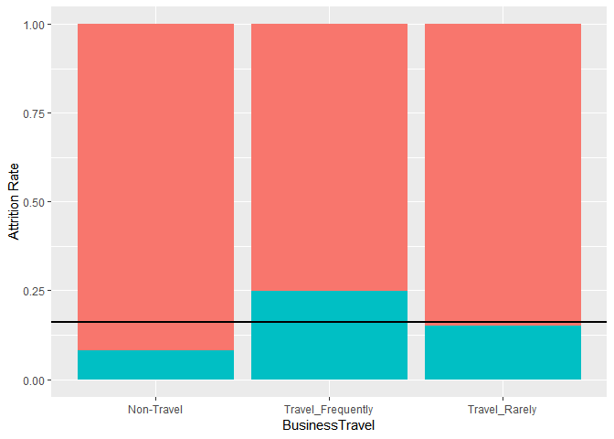<!-- -->

```r
ggplot(workers) + geom_bar(mapping = aes(x = Department, fill = Attrition), position = "fill") + 
  geom_hline(yintercept = 0.16, size = 1) + ylab("Attrition Rate") + theme(legend.position = "none")
```

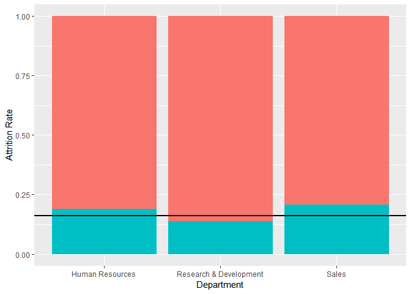<!-- -->

```r
ggplot(workers) + geom_bar(mapping = aes(x = EducationField, fill = Attrition), position = "fill")  + 
  geom_hline(yintercept = 0.16, size = 1) + ylab("Attrition Rate") + theme(legend.position = "none")
```

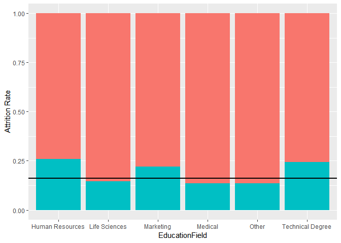<!-- -->

```r
ggplot(workers) + geom_bar(mapping = aes(x = Gender, fill = Attrition), position = "fill")  + 
  geom_hline(yintercept = 0.16, size = 1) + ylab("Attrition Rate") + theme(legend.position = "none")
```

<!-- -->

```r
ggplot(workers) + geom_bar(mapping = aes(x = JobRole, fill = Attrition), position = "fill") + 
  geom_hline(yintercept = 0.16, size = 1) + ylab("Attrition Rate") + 
  theme(legend.position = "none", axis.text.x = element_text(angle = 90, hjust = 1))
```

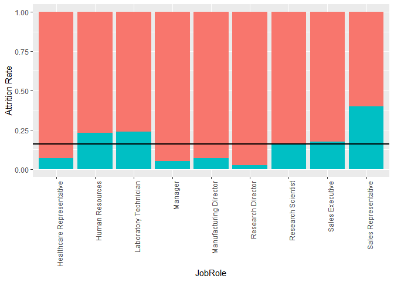<!-- -->

```r
ggplot(workers) + geom_bar(mapping = aes(x = MaritalStatus, fill = Attrition), position = "fill") + 
  geom_hline(yintercept = 0.16, size = 1) + ylab("Attrition Rate") + theme(legend.position = "none")
```

<!-- -->

```r
ggplot(workers) + geom_bar(mapping = aes(x = OverTime, fill = Attrition), position = "fill")  + 
  geom_hline(yintercept = 0.16, size = 1) + ylab("Attrition Rate") + theme(legend.position = "none")
```

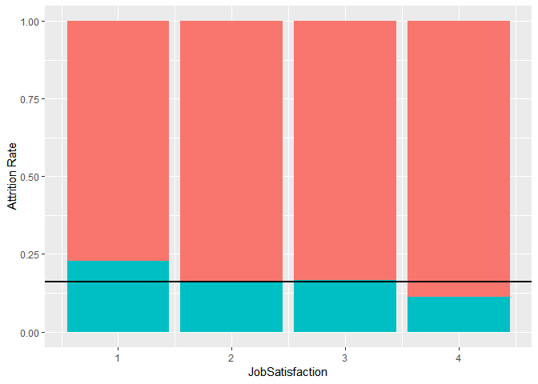<!-- -->

```r
ggplot(workers) + geom_boxplot(mapping = aes(x = Attrition, y = MonthlyIncome))
```

<!-- -->

# Creating a predictive model

We decided to use machine learning to find the three most important factors leading to attrition. We trained a support-vector machine (SVM) model to determine what factors were most associated with attrition. We determined that the top three factors were overtime, job role, and years at company. The model predicted attrition on the test data with 83.7% accuracy.


```r
library(mlr)
library(kernlab)

# Remove dummy variables since we no longer need them
#workers <- workers[,1:31]

#seperate the set into training and test data
set.seed(1)
train.sample <- sample(1470, 0.8*1470)
workers.train<-workers[train.sample,-c(32:59)]
workers.test<-workers[-train.sample,-c(32:59)]

#make the tasks to train and test
class.train <- makeClassifTask(data = workers.train, target = "Attrition", positive = "Yes")
class.test <- makeClassifTask(data = workers.test, target = "Attrition", positive = "Yes")

#normalize the features
class.train <- normalizeFeatures(class.train, method="standardize")
class.test <- normalizeFeatures(class.test, method="standardize")

#make the learner
class.learn <- makeLearner("classif.ksvm", predict.type = "prob")

#Tune the Hyperparameters
ps = makeParamSet(
  makeDiscreteParam("C", values = 2^(-4:4)),
  makeDiscreteParam("sigma", values = 2^(-4:4))
)
ctrl = makeTuneControlRandom(maxit = 20)
rdesc = makeResampleDesc("CV", iters = 3L)
res = tuneParams("classif.ksvm", task = class.train, resampling = rdesc, par.set = ps, control = ctrl)
class.learn <- setHyperPars(class.learn, par.vals = res$x)

#train the model
class.learn <- train(learner = class.learn, task = class.train)

#How did the model do?
predicted <- predict(class.learn, class.test)
performance(predicted, acc)
```

```
##       acc 
## 0.8367347
```

```r
#plot it
learningCurve <- generateLearningCurveData("classif.ksvm", class.train, percs = seq(0.05, 1, by = 0.05), measures = list(tp, fn, acc, mmce))
plotLearningCurve(learningCurve)
```

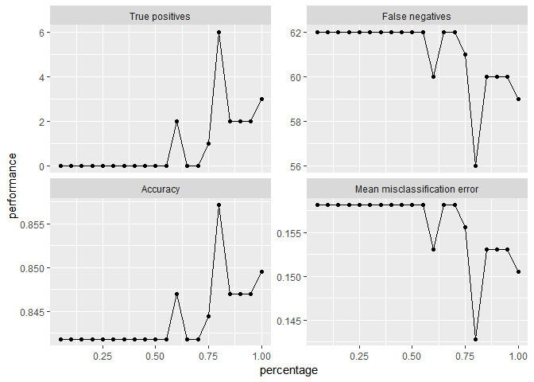<!-- -->

```r
#What features matter?
filterValues <- generateFilterValuesData(class.train, method = c("information.gain", "chi.squared"))
plotFilterValues(filterValues, n.show = 16)
```

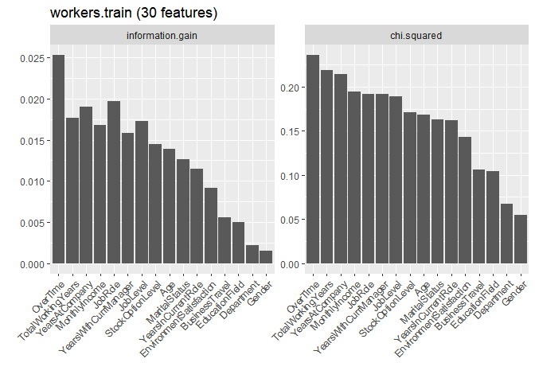<!-- -->

```r
#What does this tell us?
head(predicted$data)
```

```
##    id truth   prob.No   prob.Yes response
## 5   1    No 0.5933891 0.40661092       No
## 9   2    No 0.9099396 0.09006044       No
## 14  3    No 0.9302949 0.06970514       No
## 15  4   Yes 0.5047745 0.49522548       No
## 16  5    No 0.9173945 0.08260552       No
## 17  6    No 0.9190378 0.08096223       No
```

# Controlling for discrimination

To ensure we were not unintentionally discriminating on the basis of age, gender, or marital status, we removed these factors and trained another SVM model. The top three factors in this model were job role, overtime, and monthly income. The new model predicted attrition on the test set with an 89.8% accuracy.


```r
#seperate the set into training and test data
train.sample <- sample(1470, 0.8*1470)
workers.train <- workers[train.sample,-c(1, 10, 16, 32:59)]
workers.test <- workers[-train.sample,-c(1, 10, 16, 32:59)]

#make the tasks to train and test
legal.train <- makeClassifTask(data = workers.train, target = "Attrition", positive = "Yes")
legal.test <- makeClassifTask(data = workers.test, target = "Attrition", positive = "Yes")

#normalize the features
legal.train <- normalizeFeatures(legal.train, method="standardize")
legal.test <- normalizeFeatures(legal.test, method="standardize")

#make the learner
legal.learn <- makeLearner("classif.ksvm", predict.type = "prob")

#Tune the Hyperparameters
ps = makeParamSet(
  makeDiscreteParam("C", values = 2^(-4:4)),
  makeDiscreteParam("sigma", values = 2^(-4:4))
)
ctrl = makeTuneControlRandom(maxit = 20)
rdesc = makeResampleDesc("CV", iters = 3L)
res = tuneParams("classif.ksvm", task = legal.train, resampling = rdesc, par.set = ps, control = ctrl)
legal.learn <- setHyperPars(legal.learn, par.vals = res$x)

#train the model
legal.learn <- train(learner = legal.learn, task = legal.train)

#How did the model do?
predicted <- predict(legal.learn, legal.test)
performance(predicted, acc)
```

```
##       acc 
## 0.8979592
```

```r
#Plot that:
learningCurve2 <- generateLearningCurveData("classif.ksvm", legal.train, percs = seq(0.05, 1, by = 0.05), measures = list(tp, fn, acc, mmce))
plotLearningCurve(learningCurve2)
```

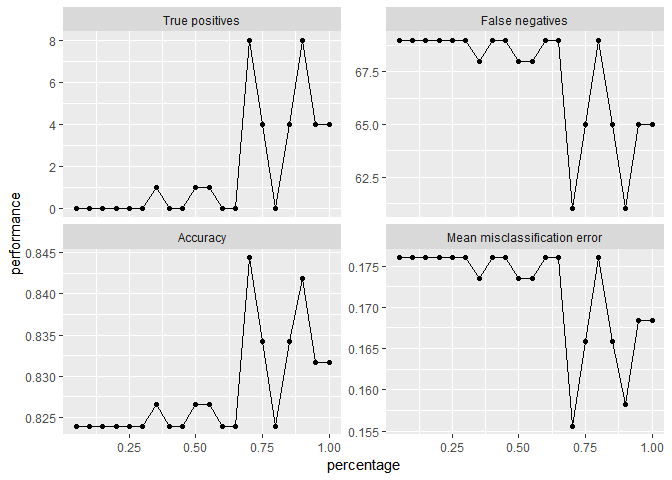<!-- -->

```r
#What features matter?
filterValues2 <- generateFilterValuesData(legal.train, method = c("information.gain", "chi.squared"))
plotFilterValues(filterValues2, n.show = 16)
```

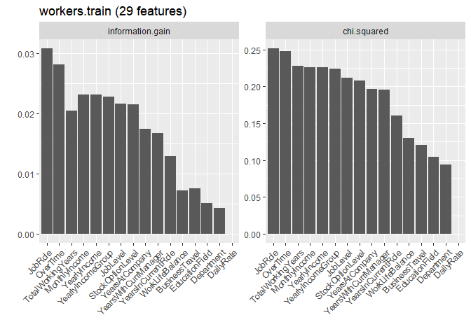<!-- -->

```r
#What does this tell us?
head(predicted$data)
```

```
##    id truth   prob.No   prob.Yes response
## 5   1    No 0.8213454 0.17865457       No
## 7   2    No 0.8460374 0.15396262       No
## 17  3    No 0.9372787 0.06272131       No
## 19  4    No 0.7145767 0.28542327       No
## 21  5    No 0.9610532 0.03894684       No
## 23  6    No 0.9499947 0.05000528       No
```

# What factors lead to high attrition for sales representatives?

We were interested in figuring out what factors led to sales representatives having a particularly high attrition rate. Using a forward selection logistic regression model, we found that the top four factors associated with attrition for sales representatives were business travel, overtime, years in current role, and job satisfaction.


```r
# Subset the data
salesRep <- workers[workers$JobRole == "Sales Representative",]
# Forward selection logistic regression to find most important factors
lm.null <- glm(Attrition ~ 1, data = salesRep, family = binomial)
add1(lm.null, ~Age + BusinessTravel + DailyRate + DistanceFromHome + Education + EnvironmentSatisfaction + Gender + HourlyRate + JobInvolvement + JobLevel + JobSatisfaction + MaritalStatus + MonthlyIncome + MonthlyRate + NumCompaniesWorked + OverTime + PercentSalaryHike + PerformanceRating + RelationshipSatisfaction + StockOptionLevel + TotalWorkingYears + TrainingTimesLastYear + WorkLifeBalance + YearsAtCompany + YearsInCurrentRole + YearsSinceLastPromotion + YearsWithCurrManager, test = "LRT")
```

```
## Single term additions
## 
## Model:
## Attrition ~ 1
##                          Df Deviance    AIC     LRT Pr(>Chi)   
## <none>                       111.556 113.56                    
## Age                       1  106.171 110.17  5.3844 0.020318 * 
## BusinessTravel            2   99.266 105.27 12.2902 0.002144 **
## DailyRate                 1  109.440 113.44  2.1155 0.145819   
## DistanceFromHome          1  111.294 115.29  0.2621 0.608711   
## Education                 1  111.276 115.28  0.2801 0.596661   
## EnvironmentSatisfaction   1  111.476 115.48  0.0797 0.777685   
## Gender                    1  111.395 115.39  0.1610 0.688254   
## HourlyRate                1  111.441 115.44  0.1147 0.734893   
## JobInvolvement            1  107.461 111.46  4.0952 0.043005 * 
## JobLevel                  1  109.197 113.20  2.3584 0.124607   
## JobSatisfaction           1  108.235 112.23  3.3204 0.068425 . 
## MaritalStatus             2  103.778 109.78  7.7774 0.020472 * 
## MonthlyIncome             1  105.546 109.55  6.0101 0.014224 * 
## MonthlyRate               1  110.972 114.97  0.5840 0.444748   
## NumCompaniesWorked        1  111.554 115.55  0.0017 0.967102   
## OverTime                  1  101.409 105.41 10.1471 0.001445 **
## PercentSalaryHike         1  110.529 114.53  1.0272 0.310827   
## PerformanceRating         1  111.309 115.31  0.2463 0.619718   
## RelationshipSatisfaction  1  110.495 114.50  1.0604 0.303120   
## StockOptionLevel          1  108.798 112.80  2.7582 0.096755 . 
## TotalWorkingYears         1  108.083 112.08  3.4732 0.062371 . 
## TrainingTimesLastYear     1  111.334 115.33  0.2215 0.637875   
## WorkLifeBalance           1  106.685 110.69  4.8703 0.027323 * 
## YearsAtCompany            1  105.712 109.71  5.8436 0.015634 * 
## YearsInCurrentRole        1  104.311 108.31  7.2447 0.007111 **
## YearsSinceLastPromotion   1  106.323 110.32  5.2331 0.022162 * 
## YearsWithCurrManager      1  107.497 111.50  4.0585 0.043951 * 
## ---
## Signif. codes:  0 '***' 0.001 '**' 0.01 '*' 0.05 '.' 0.1 ' ' 1
```

```r
add1(update(lm.null,~ . + BusinessTravel), ~Age + BusinessTravel + DailyRate + DistanceFromHome + Education + EnvironmentSatisfaction + Gender + HourlyRate + JobInvolvement + JobLevel + JobSatisfaction + MaritalStatus + MonthlyIncome + MonthlyRate + NumCompaniesWorked + OverTime + PercentSalaryHike + PerformanceRating + RelationshipSatisfaction + StockOptionLevel + TotalWorkingYears + TrainingTimesLastYear + WorkLifeBalance + YearsAtCompany + YearsInCurrentRole + YearsSinceLastPromotion + YearsWithCurrManager, test = "LRT")
```

```
## Single term additions
## 
## Model:
## Attrition ~ BusinessTravel
##                          Df Deviance    AIC    LRT Pr(>Chi)   
## <none>                        99.266 105.27                   
## Age                       1   94.316 102.32 4.9493 0.026101 * 
## DailyRate                 1   97.586 105.59 1.6795 0.194996   
## DistanceFromHome          1   99.071 107.07 0.1944 0.659277   
## Education                 1   98.293 106.29 0.9721 0.324168   
## EnvironmentSatisfaction   1   98.783 106.78 0.4825 0.487297   
## Gender                    1   99.241 107.24 0.0247 0.875168   
## HourlyRate                1   99.265 107.27 0.0002 0.987682   
## JobInvolvement            1   95.420 103.42 3.8457 0.049873 * 
## JobLevel                  1   97.141 105.14 2.1249 0.144925   
## JobSatisfaction           1   94.596 102.60 4.6699 0.030696 * 
## MaritalStatus             2   90.527 100.53 8.7380 0.012664 * 
## MonthlyIncome             1   96.113 104.11 3.1525 0.075810 . 
## MonthlyRate               1   98.542 106.54 0.7239 0.394876   
## NumCompaniesWorked        1   99.180 107.18 0.0856 0.769845   
## OverTime                  1   89.830  97.83 9.4351 0.002129 **
## PercentSalaryHike         1   98.982 106.98 0.2839 0.594136   
## PerformanceRating         1   99.263 107.26 0.0028 0.957885   
## RelationshipSatisfaction  1   97.958 105.96 1.3078 0.252787   
## StockOptionLevel          1   96.890 104.89 2.3758 0.123227   
## TotalWorkingYears         1   96.395 104.39 2.8700 0.090244 . 
## TrainingTimesLastYear     1   98.473 106.47 0.7924 0.373385   
## WorkLifeBalance           1   97.548 105.55 1.7178 0.189978   
## YearsAtCompany            1   94.472 102.47 4.7934 0.028569 * 
## YearsInCurrentRole        1   92.566 100.57 6.7000 0.009641 **
## YearsSinceLastPromotion   1   92.879 100.88 6.3860 0.011502 * 
## YearsWithCurrManager      1   95.194 103.19 4.0717 0.043607 * 
## ---
## Signif. codes:  0 '***' 0.001 '**' 0.01 '*' 0.05 '.' 0.1 ' ' 1
```

```r
add1(update(lm.null,~ . + BusinessTravel + OverTime), ~Age + BusinessTravel + DailyRate + DistanceFromHome + Education + EnvironmentSatisfaction + Gender + HourlyRate + JobInvolvement + JobLevel + JobSatisfaction + MaritalStatus + MonthlyIncome + MonthlyRate + NumCompaniesWorked + OverTime + PercentSalaryHike + PerformanceRating + RelationshipSatisfaction + StockOptionLevel + TotalWorkingYears + TrainingTimesLastYear + WorkLifeBalance + YearsAtCompany + YearsInCurrentRole + YearsSinceLastPromotion + YearsWithCurrManager, test = "LRT")
```

```
## Single term additions
## 
## Model:
## Attrition ~ BusinessTravel + OverTime
##                          Df Deviance    AIC    LRT Pr(>Chi)   
## <none>                        89.830 97.830                   
## Age                       1   83.020 93.020 6.8102 0.009064 **
## DailyRate                 1   87.190 97.190 2.6406 0.104163   
## DistanceFromHome          1   89.654 99.654 0.1761 0.674703   
## Education                 1   89.058 99.058 0.7728 0.379342   
## EnvironmentSatisfaction   1   89.343 99.343 0.4873 0.485126   
## Gender                    1   89.776 99.776 0.0548 0.814984   
## HourlyRate                1   89.798 99.798 0.0328 0.856356   
## JobInvolvement            1   86.212 96.212 3.6182 0.057150 . 
## JobLevel                  1   87.632 97.632 2.1984 0.138157   
## JobSatisfaction           1   82.031 92.031 7.7997 0.005226 **
## MaritalStatus             2   82.942 94.942 6.8885 0.031929 * 
## MonthlyIncome             1   87.239 97.239 2.5919 0.107413   
## MonthlyRate               1   89.094 99.094 0.7368 0.390690   
## NumCompaniesWorked        1   89.830 99.830 0.0002 0.987876   
## PercentSalaryHike         1   88.405 98.405 1.4256 0.232488   
## PerformanceRating         1   89.367 99.367 0.4636 0.495930   
## RelationshipSatisfaction  1   89.412 99.412 0.4187 0.517565   
## StockOptionLevel          1   86.370 96.370 3.4600 0.062871 . 
## TotalWorkingYears         1   85.966 95.966 3.8641 0.049331 * 
## TrainingTimesLastYear     1   88.842 98.842 0.9885 0.320115   
## WorkLifeBalance           1   86.819 96.819 3.0112 0.082693 . 
## YearsAtCompany            1   82.363 92.363 7.4671 0.006284 **
## YearsInCurrentRole        1   80.880 90.880 8.9504 0.002774 **
## YearsSinceLastPromotion   1   83.217 93.217 6.6130 0.010124 * 
## YearsWithCurrManager      1   82.211 92.211 7.6190 0.005776 **
## ---
## Signif. codes:  0 '***' 0.001 '**' 0.01 '*' 0.05 '.' 0.1 ' ' 1
```

```r
add1(update(lm.null,~ . + BusinessTravel + OverTime + YearsInCurrentRole), ~Age + BusinessTravel + DailyRate + DistanceFromHome + Education + EnvironmentSatisfaction + Gender + HourlyRate + JobInvolvement + JobLevel + JobSatisfaction + MaritalStatus + MonthlyIncome + MonthlyRate + NumCompaniesWorked + OverTime + PercentSalaryHike + PerformanceRating + RelationshipSatisfaction + StockOptionLevel + TotalWorkingYears + TrainingTimesLastYear + WorkLifeBalance + YearsAtCompany + YearsInCurrentRole + YearsSinceLastPromotion + YearsWithCurrManager, test = "LRT")
```

```
## Single term additions
## 
## Model:
## Attrition ~ BusinessTravel + OverTime + YearsInCurrentRole
##                          Df Deviance    AIC    LRT Pr(>Chi)  
## <none>                        80.880 90.880                  
## Age                       1   78.260 90.260 2.6199  0.10553  
## DailyRate                 1   79.008 91.008 1.8718  0.17127  
## DistanceFromHome          1   80.466 92.466 0.4143  0.51977  
## Education                 1   80.154 92.154 0.7256  0.39431  
## EnvironmentSatisfaction   1   78.744 90.744 2.1358  0.14390  
## Gender                    1   80.850 92.850 0.0302  0.86197  
## HourlyRate                1   80.781 92.781 0.0987  0.75337  
## JobInvolvement            1   77.039 89.039 3.8415  0.05000 *
## JobLevel                  1   79.833 91.833 1.0468  0.30626  
## JobSatisfaction           1   75.273 87.273 5.6068  0.01789 *
## MaritalStatus             2   76.935 90.935 3.9451  0.13910  
## MonthlyIncome             1   80.439 92.439 0.4415  0.50641  
## MonthlyRate               1   80.580 92.580 0.3001  0.58381  
## NumCompaniesWorked        1   80.831 92.831 0.0487  0.82526  
## PercentSalaryHike         1   80.117 92.117 0.7634  0.38225  
## PerformanceRating         1   80.870 92.870 0.0097  0.92143  
## RelationshipSatisfaction  1   80.115 92.115 0.7647  0.38186  
## StockOptionLevel          1   78.839 90.839 2.0412  0.15309  
## TotalWorkingYears         1   80.845 92.845 0.0352  0.85111  
## TrainingTimesLastYear     1   79.866 91.866 1.0140  0.31394  
## WorkLifeBalance           1   79.082 91.082 1.7985  0.17989  
## YearsAtCompany            1   80.880 92.880 0.0000  0.99779  
## YearsSinceLastPromotion   1   80.776 92.776 0.1044  0.74666  
## YearsWithCurrManager      1   80.635 92.635 0.2449  0.62066  
## ---
## Signif. codes:  0 '***' 0.001 '**' 0.01 '*' 0.05 '.' 0.1 ' ' 1
```

```r
summary(update(lm.null,~ . + BusinessTravel + OverTime + YearsInCurrentRole + JobSatisfaction))
```

```
## 
## Call:
## glm(formula = Attrition ~ BusinessTravel + OverTime + YearsInCurrentRole + 
##     JobSatisfaction, family = binomial, data = salesRep)
## 
## Deviance Residuals: 
##     Min       1Q   Median       3Q      Max  
## -1.9703  -0.7312  -0.1984   0.6653   2.0321  
## 
## Coefficients:
##                                  Estimate Std. Error z value Pr(>|z|)    
## (Intercept)                      -15.3499  1455.7291  -0.011 0.991587    
## BusinessTravelTravel_Frequently   18.2262  1455.7292   0.013 0.990010    
## BusinessTravelTravel_Rarely       16.3051  1455.7291   0.011 0.991063    
## OverTimeYes                        2.3225     0.6842   3.395 0.000687 ***
## YearsInCurrentRole                -0.3978     0.1773  -2.244 0.024856 *  
## JobSatisfaction                   -0.6962     0.3129  -2.225 0.026078 *  
## ---
## Signif. codes:  0 '***' 0.001 '**' 0.01 '*' 0.05 '.' 0.1 ' ' 1
## 
## (Dispersion parameter for binomial family taken to be 1)
## 
##     Null deviance: 111.556  on 82  degrees of freedom
## Residual deviance:  75.273  on 77  degrees of freedom
## AIC: 87.273
## 
## Number of Fisher Scoring iterations: 16
```

## Visualization of sales representative attrition


```r
# Plot attrition factors
ggplot(salesRep) + geom_bar(mapping = aes(x = BusinessTravel, fill = Attrition), position = "fill") +
  geom_hline(yintercept = 0.16, size = 1) + ylab("Attrition Rate") + theme(legend.position = "none")
```

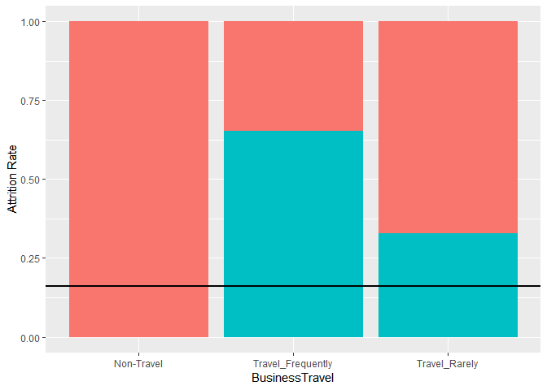<!-- -->

```r
ggplot(salesRep) + geom_bar(mapping = aes(x = OverTime, fill = Attrition), position = "fill") +
  geom_hline(yintercept = 0.16, size = 1) + ylab("Attrition Rate") + theme(legend.position = "none")
```

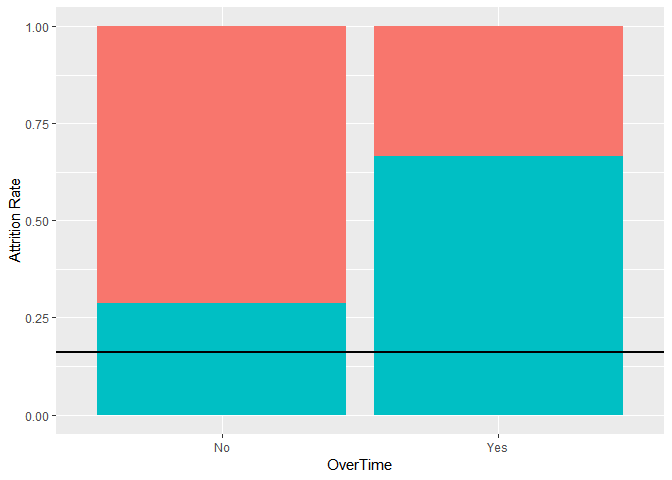<!-- -->

```r
ggplot(salesRep) + geom_bar(mapping = aes(x = YearsInCurrentRole, fill = Attrition)) +
  geom_hline(yintercept = 0.16, size = 1) + ylab("Attrition Rate") + theme(legend.position = "none")
```

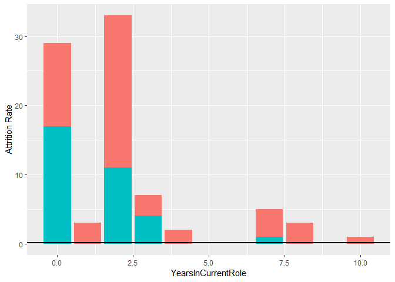<!-- -->

```r
ggplot(salesRep) + geom_bar(mapping = aes(x = JobSatisfaction, fill = Attrition), position = "fill") +
  geom_hline(yintercept = 0.16, size = 1) + ylab("Attrition Rate") + theme(legend.position = "none")
```

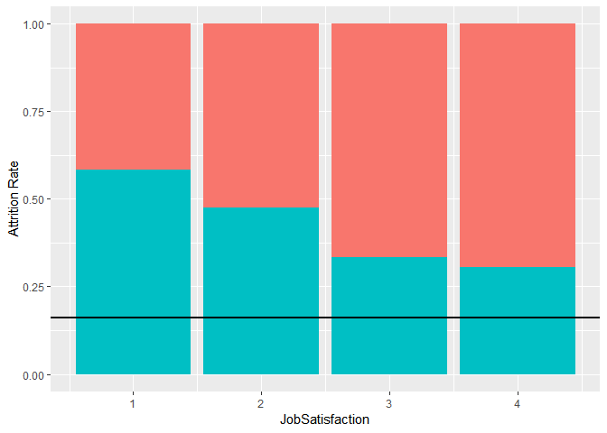<!-- -->

# What factors lead to high attrition for laboratory technicians?

Like the sales representatives, we wanted to identify the top factors leading to attrition for laboratory technicians. Again, we ran a forward selection logistic regression model. We found that the top four factors associated with attrition for laboratory technicians were


```r
# Subset the data
labTech <- workers[workers$JobRole == "Laboratory Technician",]
# Forward selection logistic regression to find most important factors
lm.null <- glm(Attrition ~ 1, data = labTech, family = binomial)
add1(lm.null, ~Age + BusinessTravel + DailyRate + DistanceFromHome + Education + EnvironmentSatisfaction + Gender + HourlyRate + JobInvolvement + JobLevel + JobSatisfaction + MaritalStatus + MonthlyIncome + MonthlyRate + NumCompaniesWorked + OverTime + PercentSalaryHike + PerformanceRating + RelationshipSatisfaction + StockOptionLevel + TotalWorkingYears + TrainingTimesLastYear + WorkLifeBalance + YearsAtCompany + YearsInCurrentRole + YearsSinceLastPromotion + YearsWithCurrManager, test = "LRT")
```

```
## Single term additions
## 
## Model:
## Attrition ~ 1
##                          Df Deviance    AIC     LRT  Pr(>Chi)    
## <none>                        285.09 287.09                      
## Age                       1   276.20 280.20  8.8862 0.0028733 ** 
## BusinessTravel            2   278.07 284.07  7.0175 0.0299343 *  
## DailyRate                 1   285.07 289.07  0.0168 0.8968015    
## DistanceFromHome          1   285.01 289.01  0.0792 0.7783169    
## Education                 1   284.92 288.92  0.1734 0.6771151    
## EnvironmentSatisfaction   1   277.98 281.98  7.1148 0.0076449 ** 
## Gender                    1   283.22 287.22  1.8723 0.1712075    
## HourlyRate                1   284.74 288.74  0.3550 0.5513100    
## JobInvolvement            1   281.29 285.29  3.7963 0.0513657 .  
## JobLevel                  1   277.77 281.77  7.3245 0.0068022 ** 
## JobSatisfaction           1   280.91 284.91  4.1841 0.0408045 *  
## MaritalStatus             2   275.35 281.35  9.7378 0.0076819 ** 
## MonthlyIncome             1   278.30 282.30  6.7869 0.0091832 ** 
## MonthlyRate               1   285.09 289.09  0.0006 0.9800896    
## NumCompaniesWorked        1   284.68 288.68  0.4130 0.5204330    
## OverTime                  1   257.44 261.44 27.6446 1.458e-07 ***
## PercentSalaryHike         1   284.23 288.23  0.8598 0.3537807    
## PerformanceRating         1   283.80 287.80  1.2924 0.2556003    
## RelationshipSatisfaction  1   285.04 289.04  0.0531 0.8177612    
## StockOptionLevel          1   274.25 278.25 10.8441 0.0009911 ***
## TotalWorkingYears         1   276.57 280.57  8.5244 0.0035042 ** 
## TrainingTimesLastYear     1   280.88 284.88  4.2063 0.0402746 *  
## WorkLifeBalance           1   270.80 274.80 14.2925 0.0001565 ***
## YearsAtCompany            1   265.28 269.28 19.8105 8.551e-06 ***
## YearsInCurrentRole        1   274.28 278.28 10.8073 0.0010110 ** 
## YearsSinceLastPromotion   1   282.32 286.32  2.7648 0.0963595 .  
## YearsWithCurrManager      1   268.59 272.59 16.4980 4.870e-05 ***
## ---
## Signif. codes:  0 '***' 0.001 '**' 0.01 '*' 0.05 '.' 0.1 ' ' 1
```

```r
add1(update(lm.null, ~ . + OverTime), ~Age + BusinessTravel + DailyRate + DistanceFromHome + Education + EnvironmentSatisfaction + Gender + HourlyRate + JobInvolvement + JobLevel + JobSatisfaction + MaritalStatus + MonthlyIncome + MonthlyRate + NumCompaniesWorked + OverTime + PercentSalaryHike + PerformanceRating + RelationshipSatisfaction + StockOptionLevel + TotalWorkingYears + TrainingTimesLastYear + WorkLifeBalance + YearsAtCompany + YearsInCurrentRole + YearsSinceLastPromotion + YearsWithCurrManager, test = "LRT")
```

```
## Single term additions
## 
## Model:
## Attrition ~ OverTime
##                          Df Deviance    AIC     LRT  Pr(>Chi)    
## <none>                        257.44 261.44                      
## Age                       1   246.32 252.32 11.1210 0.0008536 ***
## BusinessTravel            2   251.77 259.77  5.6783 0.0584768 .  
## DailyRate                 1   257.26 263.26  0.1867 0.6657145    
## DistanceFromHome          1   257.35 263.35  0.0998 0.7520943    
## Education                 1   257.20 263.20  0.2474 0.6189433    
## EnvironmentSatisfaction   1   244.65 250.65 12.7936 0.0003478 ***
## Gender                    1   255.44 261.44  2.0063 0.1566502    
## HourlyRate                1   257.44 263.44  0.0000 0.9951940    
## JobInvolvement            1   253.28 259.28  4.1639 0.0412950 *  
## JobLevel                  1   249.18 255.18  8.2613 0.0040498 ** 
## JobSatisfaction           1   252.59 258.59  4.8543 0.0275776 *  
## MaritalStatus             2   244.40 252.40 13.0424 0.0014719 ** 
## MonthlyIncome             1   247.60 253.60  9.8472 0.0017009 ** 
## MonthlyRate               1   257.37 263.37  0.0712 0.7896035    
## NumCompaniesWorked        1   256.66 262.66  0.7849 0.3756517    
## PercentSalaryHike         1   256.53 262.53  0.9178 0.3380548    
## PerformanceRating         1   255.96 261.96  1.4887 0.2224108    
## RelationshipSatisfaction  1   256.62 262.62  0.8245 0.3638772    
## StockOptionLevel          1   244.54 250.54 12.9003 0.0003285 ***
## TotalWorkingYears         1   248.39 254.39  9.0525 0.0026234 ** 
## TrainingTimesLastYear     1   255.48 261.48  1.9691 0.1605452    
## WorkLifeBalance           1   247.53 253.53  9.9107 0.0016432 ** 
## YearsAtCompany            1   239.37 245.37 18.0781  2.12e-05 ***
## YearsInCurrentRole        1   245.34 251.34 12.1033 0.0005033 ***
## YearsSinceLastPromotion   1   255.74 261.74  1.7056 0.1915625    
## YearsWithCurrManager      1   242.38 248.38 15.0612 0.0001041 ***
## ---
## Signif. codes:  0 '***' 0.001 '**' 0.01 '*' 0.05 '.' 0.1 ' ' 1
```

```r
add1(update(lm.null, ~ . + OverTime + YearsAtCompany), ~Age + BusinessTravel + DailyRate + DistanceFromHome + Education + EnvironmentSatisfaction + Gender + HourlyRate + JobInvolvement + JobLevel + JobSatisfaction + MaritalStatus + MonthlyIncome + MonthlyRate + NumCompaniesWorked + OverTime + PercentSalaryHike + PerformanceRating + RelationshipSatisfaction + StockOptionLevel + TotalWorkingYears + TrainingTimesLastYear + WorkLifeBalance + YearsAtCompany + YearsInCurrentRole + YearsSinceLastPromotion + YearsWithCurrManager, test = "LRT")
```

```
## Single term additions
## 
## Model:
## Attrition ~ OverTime + YearsAtCompany
##                          Df Deviance    AIC     LRT  Pr(>Chi)    
## <none>                        239.37 245.37                      
## Age                       1   232.95 240.95  6.4131 0.0113284 *  
## BusinessTravel            2   233.68 243.68  5.6845 0.0582955 .  
## DailyRate                 1   238.80 246.80  0.5702 0.4501925    
## DistanceFromHome          1   238.50 246.50  0.8702 0.3508932    
## Education                 1   239.22 247.22  0.1443 0.7040649    
## EnvironmentSatisfaction   1   228.52 236.52 10.8463 0.0009899 ***
## Gender                    1   237.43 245.43  1.9347 0.1642435    
## HourlyRate                1   239.32 247.32  0.0424 0.8367832    
## JobInvolvement            1   235.81 243.81  3.5615 0.0591342 .  
## JobLevel                  1   237.32 245.32  2.0429 0.1529201    
## JobSatisfaction           1   232.82 240.82  6.5494 0.0104918 *  
## MaritalStatus             2   227.70 237.70 11.6664 0.0029286 ** 
## MonthlyIncome             1   237.00 245.00  2.3701 0.1236801    
## MonthlyRate               1   239.34 247.34  0.0328 0.8563649    
## NumCompaniesWorked        1   239.29 247.29  0.0739 0.7857541    
## PercentSalaryHike         1   239.21 247.21  0.1536 0.6951460    
## PerformanceRating         1   238.84 246.84  0.5243 0.4690058    
## RelationshipSatisfaction  1   238.24 246.24  1.1305 0.2876735    
## StockOptionLevel          1   226.87 234.87 12.4939 0.0004083 ***
## TotalWorkingYears         1   238.95 246.95  0.4164 0.5187220    
## TrainingTimesLastYear     1   237.71 245.71  1.6611 0.1974568    
## WorkLifeBalance           1   232.20 240.20  7.1671 0.0074254 ** 
## YearsInCurrentRole        1   238.91 246.91  0.4551 0.4999342    
## YearsSinceLastPromotion   1   237.96 245.96  1.4042 0.2360133    
## YearsWithCurrManager      1   239.20 247.20  0.1632 0.6862188    
## ---
## Signif. codes:  0 '***' 0.001 '**' 0.01 '*' 0.05 '.' 0.1 ' ' 1
```

```r
add1(update(lm.null, ~ . + OverTime + YearsAtCompany + StockOptionLevel), ~Age + BusinessTravel + DailyRate + DistanceFromHome + Education + EnvironmentSatisfaction + Gender + HourlyRate + JobInvolvement + JobLevel + JobSatisfaction + MaritalStatus + MonthlyIncome + MonthlyRate + NumCompaniesWorked + OverTime + PercentSalaryHike + PerformanceRating + RelationshipSatisfaction + StockOptionLevel + TotalWorkingYears + TrainingTimesLastYear + WorkLifeBalance + YearsAtCompany + YearsInCurrentRole + YearsSinceLastPromotion + YearsWithCurrManager, test = "LRT")
```

```
## Single term additions
## 
## Model:
## Attrition ~ OverTime + YearsAtCompany + StockOptionLevel
##                          Df Deviance    AIC    LRT Pr(>Chi)   
## <none>                        226.87 234.87                   
## Age                       1   221.11 231.11 5.7640 0.016357 * 
## BusinessTravel            2   222.06 234.06 4.8098 0.090276 . 
## DailyRate                 1   226.63 236.63 0.2423 0.622567   
## DistanceFromHome          1   225.66 235.66 1.2182 0.269722   
## Education                 1   226.71 236.71 0.1630 0.686375   
## EnvironmentSatisfaction   1   217.42 227.42 9.4504 0.002111 **
## Gender                    1   224.70 234.70 2.1738 0.140380   
## HourlyRate                1   226.80 236.80 0.0740 0.785583   
## JobInvolvement            1   223.64 233.64 3.2324 0.072194 . 
## JobLevel                  1   224.20 234.20 2.6754 0.101913   
## JobSatisfaction           1   220.29 230.29 6.5862 0.010277 * 
## MaritalStatus             2   223.80 235.80 3.0712 0.215323   
## MonthlyIncome             1   224.15 234.15 2.7263 0.098705 . 
## MonthlyRate               1   226.59 236.59 0.2856 0.593080   
## NumCompaniesWorked        1   226.75 236.75 0.1271 0.721460   
## PercentSalaryHike         1   226.61 236.61 0.2668 0.605467   
## PerformanceRating         1   226.05 236.05 0.8268 0.363193   
## RelationshipSatisfaction  1   224.86 234.86 2.0146 0.155796   
## TotalWorkingYears         1   226.02 236.02 0.8546 0.355245   
## TrainingTimesLastYear     1   223.97 233.97 2.9047 0.088320 . 
## WorkLifeBalance           1   221.18 231.18 5.6894 0.017068 * 
## YearsInCurrentRole        1   226.28 236.28 0.5983 0.439236   
## YearsSinceLastPromotion   1   225.19 235.19 1.6817 0.194697   
## YearsWithCurrManager      1   226.56 236.56 0.3140 0.575262   
## ---
## Signif. codes:  0 '***' 0.001 '**' 0.01 '*' 0.05 '.' 0.1 ' ' 1
```

```r
summary(update(lm.null, ~ . + OverTime + YearsAtCompany + StockOptionLevel + EnvironmentSatisfaction))
```

```
## 
## Call:
## glm(formula = Attrition ~ OverTime + YearsAtCompany + StockOptionLevel + 
##     EnvironmentSatisfaction, family = binomial, data = labTech)
## 
## Deviance Residuals: 
##     Min       1Q   Median       3Q      Max  
## -1.6361  -0.6637  -0.3943  -0.1056   2.8438  
## 
## Coefficients:
##                         Estimate Std. Error z value Pr(>|z|)    
## (Intercept)              0.73281    0.47149   1.554  0.12013    
## OverTimeYes              2.08429    0.38317   5.440 5.34e-08 ***
## YearsAtCompany          -0.19767    0.05688  -3.475  0.00051 ***
## StockOptionLevel        -0.72376    0.23841  -3.036  0.00240 ** 
## EnvironmentSatisfaction -0.46615    0.15578  -2.992  0.00277 ** 
## ---
## Signif. codes:  0 '***' 0.001 '**' 0.01 '*' 0.05 '.' 0.1 ' ' 1
## 
## (Dispersion parameter for binomial family taken to be 1)
## 
##     Null deviance: 285.09  on 258  degrees of freedom
## Residual deviance: 217.42  on 254  degrees of freedom
## AIC: 227.42
## 
## Number of Fisher Scoring iterations: 5
```

## Visualization of laboratory technician attrition


```r
# Plot attrition factors
ggplot(labTech) + geom_bar(mapping = aes(x = OverTime, fill = Attrition), position = "fill") +
  geom_hline(yintercept = 0.16, size = 1) + ylab("Attrition Rate") + theme(legend.position = "none")
```

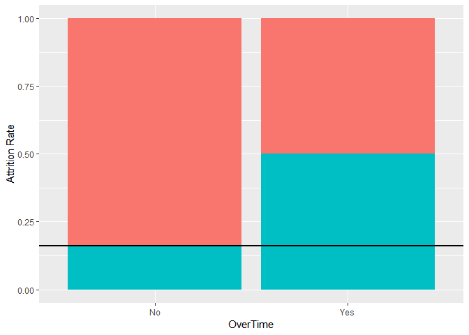<!-- -->

```r
ggplot(labTech) + geom_bar(mapping = aes(x = YearsAtCompany, fill = Attrition)) +
  geom_hline(yintercept = 0.16, size = 1) + ylab("Attrition Rate") + theme(legend.position = "none")
```

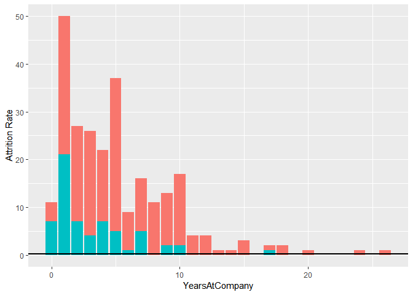<!-- -->

```r
ggplot(labTech) + geom_bar(mapping = aes(x = StockOptionLevel, fill = Attrition), position = "fill") +
  geom_hline(yintercept = 0.16, size = 1) + ylab("Attrition Rate") + theme(legend.position = "none")
```

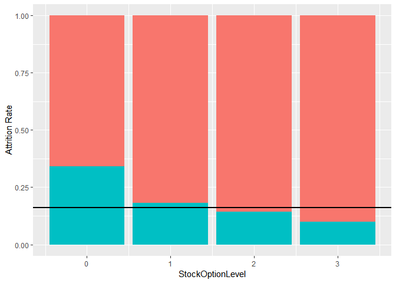<!-- -->

```r
ggplot(labTech) + geom_bar(mapping = aes(x = EnvironmentSatisfaction, fill = Attrition), position = "fill") +
  geom_hline(yintercept = 0.16, size = 1) + ylab("Attrition Rate") + theme(legend.position = "none")
```

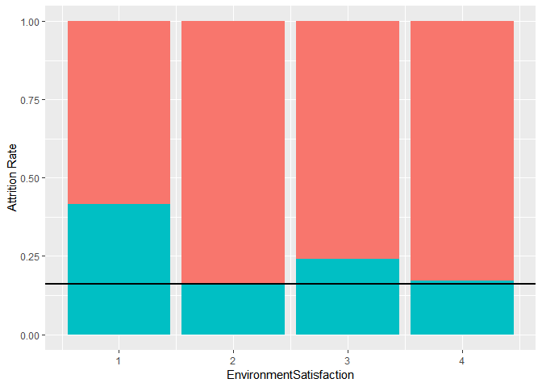<!-- -->
