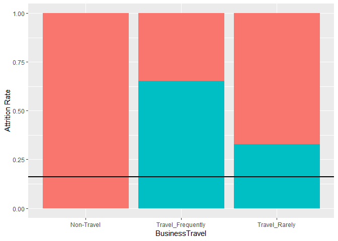
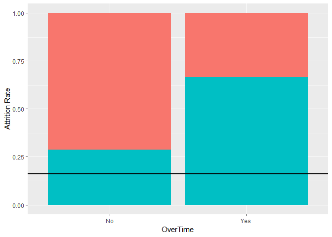
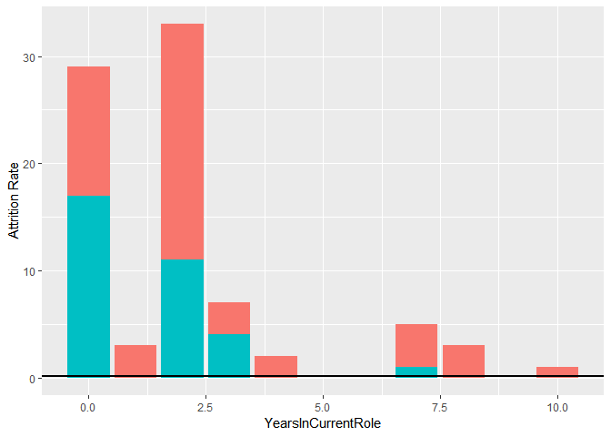
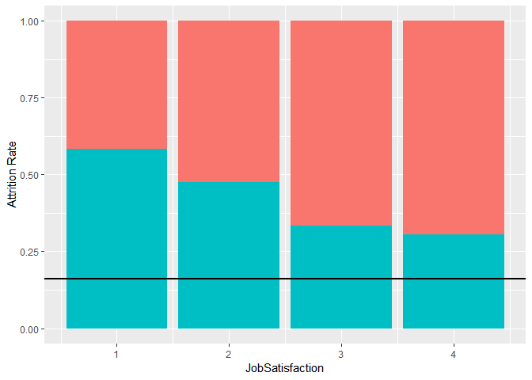
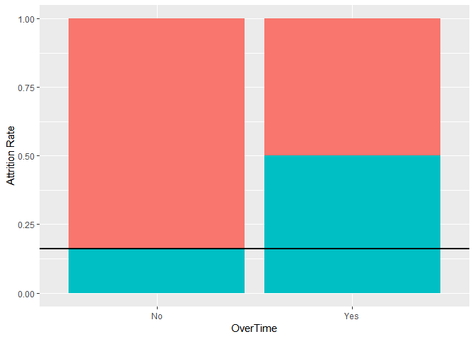
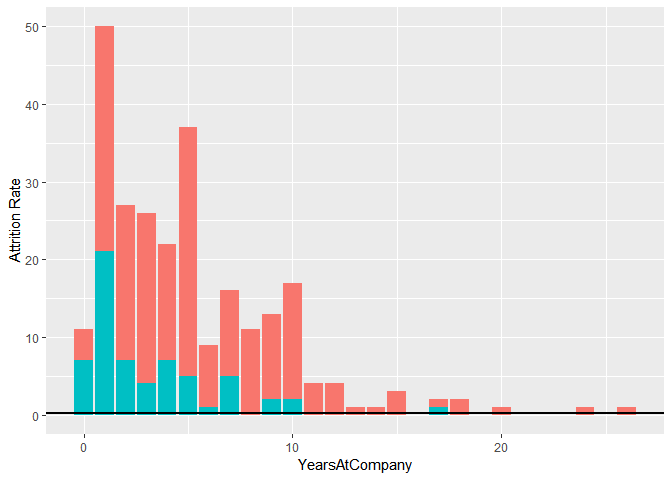
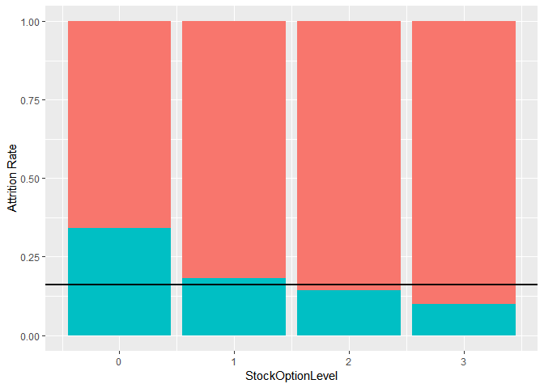
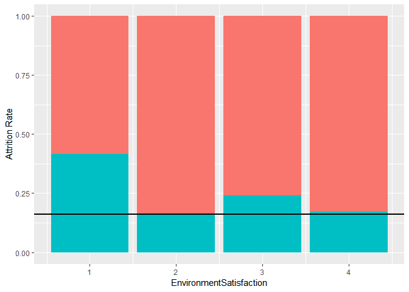

# What factors make sales representatives leave?

```r
# Read and subset the data
workers <- read.csv("CaseStudy2-data.csv")
names(workers)[1] <- "Age"
salesRep <- workers[workers$JobRole == "Sales Representative",]
# Forward selection logistic regression to find most important factors
lm.null <- glm(Attrition ~ 1, data = salesRep, family = binomial)
add1(lm.null, ~Age + BusinessTravel + DailyRate + DistanceFromHome + Education + EnvironmentSatisfaction + Gender + HourlyRate + JobInvolvement + JobLevel + JobSatisfaction + MaritalStatus + MonthlyIncome + MonthlyRate + NumCompaniesWorked + OverTime + PercentSalaryHike + PerformanceRating + RelationshipSatisfaction + StockOptionLevel + TotalWorkingYears + TrainingTimesLastYear + WorkLifeBalance + YearsAtCompany + YearsInCurrentRole + YearsSinceLastPromotion + YearsWithCurrManager, test = "LRT")
```

```
## Single term additions
## 
## Model:
## Attrition ~ 1
##                          Df Deviance    AIC     LRT Pr(>Chi)   
## <none>                       111.556 113.56                    
## Age                       1  106.171 110.17  5.3844 0.020318 * 
## BusinessTravel            2   99.266 105.27 12.2902 0.002144 **
## DailyRate                 1  109.440 113.44  2.1155 0.145819   
## DistanceFromHome          1  111.294 115.29  0.2621 0.608711   
## Education                 1  111.276 115.28  0.2801 0.596661   
## EnvironmentSatisfaction   1  111.476 115.48  0.0797 0.777685   
## Gender                    1  111.395 115.39  0.1610 0.688254   
## HourlyRate                1  111.441 115.44  0.1147 0.734893   
## JobInvolvement            1  107.461 111.46  4.0952 0.043005 * 
## JobLevel                  1  109.197 113.20  2.3584 0.124607   
## JobSatisfaction           1  108.235 112.23  3.3204 0.068425 . 
## MaritalStatus             2  103.778 109.78  7.7774 0.020472 * 
## MonthlyIncome             1  105.546 109.55  6.0101 0.014224 * 
## MonthlyRate               1  110.972 114.97  0.5840 0.444748   
## NumCompaniesWorked        1  111.554 115.55  0.0017 0.967102   
## OverTime                  1  101.409 105.41 10.1471 0.001445 **
## PercentSalaryHike         1  110.529 114.53  1.0272 0.310827   
## PerformanceRating         1  111.309 115.31  0.2463 0.619718   
## RelationshipSatisfaction  1  110.495 114.50  1.0604 0.303120   
## StockOptionLevel          1  108.798 112.80  2.7582 0.096755 . 
## TotalWorkingYears         1  108.083 112.08  3.4732 0.062371 . 
## TrainingTimesLastYear     1  111.334 115.33  0.2215 0.637875   
## WorkLifeBalance           1  106.685 110.69  4.8703 0.027323 * 
## YearsAtCompany            1  105.712 109.71  5.8436 0.015634 * 
## YearsInCurrentRole        1  104.311 108.31  7.2447 0.007111 **
## YearsSinceLastPromotion   1  106.323 110.32  5.2331 0.022162 * 
## YearsWithCurrManager      1  107.497 111.50  4.0585 0.043951 * 
## ---
## Signif. codes:  0 '***' 0.001 '**' 0.01 '*' 0.05 '.' 0.1 ' ' 1
```

```r
add1(update(lm.null,~ . + BusinessTravel), ~Age + BusinessTravel + DailyRate + DistanceFromHome + Education + EnvironmentSatisfaction + Gender + HourlyRate + JobInvolvement + JobLevel + JobSatisfaction + MaritalStatus + MonthlyIncome + MonthlyRate + NumCompaniesWorked + OverTime + PercentSalaryHike + PerformanceRating + RelationshipSatisfaction + StockOptionLevel + TotalWorkingYears + TrainingTimesLastYear + WorkLifeBalance + YearsAtCompany + YearsInCurrentRole + YearsSinceLastPromotion + YearsWithCurrManager, test = "LRT")
```

```
## Single term additions
## 
## Model:
## Attrition ~ BusinessTravel
##                          Df Deviance    AIC    LRT Pr(>Chi)   
## <none>                        99.266 105.27                   
## Age                       1   94.316 102.32 4.9493 0.026101 * 
## DailyRate                 1   97.586 105.59 1.6795 0.194996   
## DistanceFromHome          1   99.071 107.07 0.1944 0.659277   
## Education                 1   98.293 106.29 0.9721 0.324168   
## EnvironmentSatisfaction   1   98.783 106.78 0.4825 0.487297   
## Gender                    1   99.241 107.24 0.0247 0.875168   
## HourlyRate                1   99.265 107.27 0.0002 0.987682   
## JobInvolvement            1   95.420 103.42 3.8457 0.049873 * 
## JobLevel                  1   97.141 105.14 2.1249 0.144925   
## JobSatisfaction           1   94.596 102.60 4.6699 0.030696 * 
## MaritalStatus             2   90.527 100.53 8.7380 0.012664 * 
## MonthlyIncome             1   96.113 104.11 3.1525 0.075810 . 
## MonthlyRate               1   98.542 106.54 0.7239 0.394876   
## NumCompaniesWorked        1   99.180 107.18 0.0856 0.769845   
## OverTime                  1   89.830  97.83 9.4351 0.002129 **
## PercentSalaryHike         1   98.982 106.98 0.2839 0.594136   
## PerformanceRating         1   99.263 107.26 0.0028 0.957885   
## RelationshipSatisfaction  1   97.958 105.96 1.3078 0.252787   
## StockOptionLevel          1   96.890 104.89 2.3758 0.123227   
## TotalWorkingYears         1   96.395 104.39 2.8700 0.090244 . 
## TrainingTimesLastYear     1   98.473 106.47 0.7924 0.373385   
## WorkLifeBalance           1   97.548 105.55 1.7178 0.189978   
## YearsAtCompany            1   94.472 102.47 4.7934 0.028569 * 
## YearsInCurrentRole        1   92.566 100.57 6.7000 0.009641 **
## YearsSinceLastPromotion   1   92.879 100.88 6.3860 0.011502 * 
## YearsWithCurrManager      1   95.194 103.19 4.0717 0.043607 * 
## ---
## Signif. codes:  0 '***' 0.001 '**' 0.01 '*' 0.05 '.' 0.1 ' ' 1
```

```r
add1(update(lm.null,~ . + BusinessTravel + OverTime), ~Age + BusinessTravel + DailyRate + DistanceFromHome + Education + EnvironmentSatisfaction + Gender + HourlyRate + JobInvolvement + JobLevel + JobSatisfaction + MaritalStatus + MonthlyIncome + MonthlyRate + NumCompaniesWorked + OverTime + PercentSalaryHike + PerformanceRating + RelationshipSatisfaction + StockOptionLevel + TotalWorkingYears + TrainingTimesLastYear + WorkLifeBalance + YearsAtCompany + YearsInCurrentRole + YearsSinceLastPromotion + YearsWithCurrManager, test = "LRT")
```

```
## Single term additions
## 
## Model:
## Attrition ~ BusinessTravel + OverTime
##                          Df Deviance    AIC    LRT Pr(>Chi)   
## <none>                        89.830 97.830                   
## Age                       1   83.020 93.020 6.8102 0.009064 **
## DailyRate                 1   87.190 97.190 2.6406 0.104163   
## DistanceFromHome          1   89.654 99.654 0.1761 0.674703   
## Education                 1   89.058 99.058 0.7728 0.379342   
## EnvironmentSatisfaction   1   89.343 99.343 0.4873 0.485126   
## Gender                    1   89.776 99.776 0.0548 0.814984   
## HourlyRate                1   89.798 99.798 0.0328 0.856356   
## JobInvolvement            1   86.212 96.212 3.6182 0.057150 . 
## JobLevel                  1   87.632 97.632 2.1984 0.138157   
## JobSatisfaction           1   82.031 92.031 7.7997 0.005226 **
## MaritalStatus             2   82.942 94.942 6.8885 0.031929 * 
## MonthlyIncome             1   87.239 97.239 2.5919 0.107413   
## MonthlyRate               1   89.094 99.094 0.7368 0.390690   
## NumCompaniesWorked        1   89.830 99.830 0.0002 0.987876   
## PercentSalaryHike         1   88.405 98.405 1.4256 0.232488   
## PerformanceRating         1   89.367 99.367 0.4636 0.495930   
## RelationshipSatisfaction  1   89.412 99.412 0.4187 0.517565   
## StockOptionLevel          1   86.370 96.370 3.4600 0.062871 . 
## TotalWorkingYears         1   85.966 95.966 3.8641 0.049331 * 
## TrainingTimesLastYear     1   88.842 98.842 0.9885 0.320115   
## WorkLifeBalance           1   86.819 96.819 3.0112 0.082693 . 
## YearsAtCompany            1   82.363 92.363 7.4671 0.006284 **
## YearsInCurrentRole        1   80.880 90.880 8.9504 0.002774 **
## YearsSinceLastPromotion   1   83.217 93.217 6.6130 0.010124 * 
## YearsWithCurrManager      1   82.211 92.211 7.6190 0.005776 **
## ---
## Signif. codes:  0 '***' 0.001 '**' 0.01 '*' 0.05 '.' 0.1 ' ' 1
```

```r
add1(update(lm.null,~ . + BusinessTravel + OverTime + YearsInCurrentRole), ~Age + BusinessTravel + DailyRate + DistanceFromHome + Education + EnvironmentSatisfaction + Gender + HourlyRate + JobInvolvement + JobLevel + JobSatisfaction + MaritalStatus + MonthlyIncome + MonthlyRate + NumCompaniesWorked + OverTime + PercentSalaryHike + PerformanceRating + RelationshipSatisfaction + StockOptionLevel + TotalWorkingYears + TrainingTimesLastYear + WorkLifeBalance + YearsAtCompany + YearsInCurrentRole + YearsSinceLastPromotion + YearsWithCurrManager, test = "LRT")
```

```
## Single term additions
## 
## Model:
## Attrition ~ BusinessTravel + OverTime + YearsInCurrentRole
##                          Df Deviance    AIC    LRT Pr(>Chi)  
## <none>                        80.880 90.880                  
## Age                       1   78.260 90.260 2.6199  0.10553  
## DailyRate                 1   79.008 91.008 1.8718  0.17127  
## DistanceFromHome          1   80.466 92.466 0.4143  0.51977  
## Education                 1   80.154 92.154 0.7256  0.39431  
## EnvironmentSatisfaction   1   78.744 90.744 2.1358  0.14390  
## Gender                    1   80.850 92.850 0.0302  0.86197  
## HourlyRate                1   80.781 92.781 0.0987  0.75337  
## JobInvolvement            1   77.039 89.039 3.8415  0.05000 *
## JobLevel                  1   79.833 91.833 1.0468  0.30626  
## JobSatisfaction           1   75.273 87.273 5.6068  0.01789 *
## MaritalStatus             2   76.935 90.935 3.9451  0.13910  
## MonthlyIncome             1   80.439 92.439 0.4415  0.50641  
## MonthlyRate               1   80.580 92.580 0.3001  0.58381  
## NumCompaniesWorked        1   80.831 92.831 0.0487  0.82526  
## PercentSalaryHike         1   80.117 92.117 0.7634  0.38225  
## PerformanceRating         1   80.870 92.870 0.0097  0.92143  
## RelationshipSatisfaction  1   80.115 92.115 0.7647  0.38186  
## StockOptionLevel          1   78.839 90.839 2.0412  0.15309  
## TotalWorkingYears         1   80.845 92.845 0.0352  0.85111  
## TrainingTimesLastYear     1   79.866 91.866 1.0140  0.31394  
## WorkLifeBalance           1   79.082 91.082 1.7985  0.17989  
## YearsAtCompany            1   80.880 92.880 0.0000  0.99779  
## YearsSinceLastPromotion   1   80.776 92.776 0.1044  0.74666  
## YearsWithCurrManager      1   80.635 92.635 0.2449  0.62066  
## ---
## Signif. codes:  0 '***' 0.001 '**' 0.01 '*' 0.05 '.' 0.1 ' ' 1
```

```r
summary(update(lm.null,~ . + BusinessTravel + OverTime + YearsInCurrentRole + JobSatisfaction))
```

```
## 
## Call:
## glm(formula = Attrition ~ BusinessTravel + OverTime + YearsInCurrentRole + 
##     JobSatisfaction, family = binomial, data = salesRep)
## 
## Deviance Residuals: 
##     Min       1Q   Median       3Q      Max  
## -1.9703  -0.7312  -0.1984   0.6653   2.0321  
## 
## Coefficients:
##                                  Estimate Std. Error z value Pr(>|z|)    
## (Intercept)                      -15.3499  1455.7291  -0.011 0.991587    
## BusinessTravelTravel_Frequently   18.2262  1455.7292   0.013 0.990010    
## BusinessTravelTravel_Rarely       16.3051  1455.7291   0.011 0.991063    
## OverTimeYes                        2.3225     0.6842   3.395 0.000687 ***
## YearsInCurrentRole                -0.3978     0.1773  -2.244 0.024856 *  
## JobSatisfaction                   -0.6962     0.3129  -2.225 0.026078 *  
## ---
## Signif. codes:  0 '***' 0.001 '**' 0.01 '*' 0.05 '.' 0.1 ' ' 1
## 
## (Dispersion parameter for binomial family taken to be 1)
## 
##     Null deviance: 111.556  on 82  degrees of freedom
## Residual deviance:  75.273  on 77  degrees of freedom
## AIC: 87.273
## 
## Number of Fisher Scoring iterations: 16
```

```r
# Plot attrition factors
library(ggplot2)
ggplot(salesRep) + geom_bar(mapping = aes(x = BusinessTravel, fill = Attrition), position = "fill") +
  geom_hline(yintercept = 0.16, size = 1) + ylab("Attrition Rate") + theme(legend.position = "none")
```

<!-- -->

```r
ggplot(salesRep) + geom_bar(mapping = aes(x = OverTime, fill = Attrition), position = "fill") +
  geom_hline(yintercept = 0.16, size = 1) + ylab("Attrition Rate") + theme(legend.position = "none")
```

<!-- -->

```r
ggplot(salesRep) + geom_bar(mapping = aes(x = YearsInCurrentRole, fill = Attrition)) +
  geom_hline(yintercept = 0.16, size = 1) + ylab("Attrition Rate") + theme(legend.position = "none")
```

<!-- -->

```r
ggplot(salesRep) + geom_bar(mapping = aes(x = JobSatisfaction, fill = Attrition), position = "fill") +
  geom_hline(yintercept = 0.16, size = 1) + ylab("Attrition Rate") + theme(legend.position = "none")
```

<!-- -->

# What factors make laboratory technicians leave?

```r
# Subset the data
labTech <- workers[workers$JobRole == "Laboratory Technician",]
# Forward selection logistic regression to find most important factors
lm.null <- glm(Attrition ~ 1, data = labTech, family = binomial)
add1(lm.null, ~Age + BusinessTravel + DailyRate + DistanceFromHome + Education + EnvironmentSatisfaction + Gender + HourlyRate + JobInvolvement + JobLevel + JobSatisfaction + MaritalStatus + MonthlyIncome + MonthlyRate + NumCompaniesWorked + OverTime + PercentSalaryHike + PerformanceRating + RelationshipSatisfaction + StockOptionLevel + TotalWorkingYears + TrainingTimesLastYear + WorkLifeBalance + YearsAtCompany + YearsInCurrentRole + YearsSinceLastPromotion + YearsWithCurrManager, test = "LRT")
```

```
## Single term additions
## 
## Model:
## Attrition ~ 1
##                          Df Deviance    AIC     LRT  Pr(>Chi)    
## <none>                        285.09 287.09                      
## Age                       1   276.20 280.20  8.8862 0.0028733 ** 
## BusinessTravel            2   278.07 284.07  7.0175 0.0299343 *  
## DailyRate                 1   285.07 289.07  0.0168 0.8968015    
## DistanceFromHome          1   285.01 289.01  0.0792 0.7783169    
## Education                 1   284.92 288.92  0.1734 0.6771151    
## EnvironmentSatisfaction   1   277.98 281.98  7.1148 0.0076449 ** 
## Gender                    1   283.22 287.22  1.8723 0.1712075    
## HourlyRate                1   284.74 288.74  0.3550 0.5513100    
## JobInvolvement            1   281.29 285.29  3.7963 0.0513657 .  
## JobLevel                  1   277.77 281.77  7.3245 0.0068022 ** 
## JobSatisfaction           1   280.91 284.91  4.1841 0.0408045 *  
## MaritalStatus             2   275.35 281.35  9.7378 0.0076819 ** 
## MonthlyIncome             1   278.30 282.30  6.7869 0.0091832 ** 
## MonthlyRate               1   285.09 289.09  0.0006 0.9800896    
## NumCompaniesWorked        1   284.68 288.68  0.4130 0.5204330    
## OverTime                  1   257.44 261.44 27.6446 1.458e-07 ***
## PercentSalaryHike         1   284.23 288.23  0.8598 0.3537807    
## PerformanceRating         1   283.80 287.80  1.2924 0.2556003    
## RelationshipSatisfaction  1   285.04 289.04  0.0531 0.8177612    
## StockOptionLevel          1   274.25 278.25 10.8441 0.0009911 ***
## TotalWorkingYears         1   276.57 280.57  8.5244 0.0035042 ** 
## TrainingTimesLastYear     1   280.88 284.88  4.2063 0.0402746 *  
## WorkLifeBalance           1   270.80 274.80 14.2925 0.0001565 ***
## YearsAtCompany            1   265.28 269.28 19.8105 8.551e-06 ***
## YearsInCurrentRole        1   274.28 278.28 10.8073 0.0010110 ** 
## YearsSinceLastPromotion   1   282.32 286.32  2.7648 0.0963595 .  
## YearsWithCurrManager      1   268.59 272.59 16.4980 4.870e-05 ***
## ---
## Signif. codes:  0 '***' 0.001 '**' 0.01 '*' 0.05 '.' 0.1 ' ' 1
```

```r
add1(update(lm.null, ~ . + OverTime), ~Age + BusinessTravel + DailyRate + DistanceFromHome + Education + EnvironmentSatisfaction + Gender + HourlyRate + JobInvolvement + JobLevel + JobSatisfaction + MaritalStatus + MonthlyIncome + MonthlyRate + NumCompaniesWorked + OverTime + PercentSalaryHike + PerformanceRating + RelationshipSatisfaction + StockOptionLevel + TotalWorkingYears + TrainingTimesLastYear + WorkLifeBalance + YearsAtCompany + YearsInCurrentRole + YearsSinceLastPromotion + YearsWithCurrManager, test = "LRT")
```

```
## Single term additions
## 
## Model:
## Attrition ~ OverTime
##                          Df Deviance    AIC     LRT  Pr(>Chi)    
## <none>                        257.44 261.44                      
## Age                       1   246.32 252.32 11.1210 0.0008536 ***
## BusinessTravel            2   251.77 259.77  5.6783 0.0584768 .  
## DailyRate                 1   257.26 263.26  0.1867 0.6657145    
## DistanceFromHome          1   257.35 263.35  0.0998 0.7520943    
## Education                 1   257.20 263.20  0.2474 0.6189433    
## EnvironmentSatisfaction   1   244.65 250.65 12.7936 0.0003478 ***
## Gender                    1   255.44 261.44  2.0063 0.1566502    
## HourlyRate                1   257.44 263.44  0.0000 0.9951940    
## JobInvolvement            1   253.28 259.28  4.1639 0.0412950 *  
## JobLevel                  1   249.18 255.18  8.2613 0.0040498 ** 
## JobSatisfaction           1   252.59 258.59  4.8543 0.0275776 *  
## MaritalStatus             2   244.40 252.40 13.0424 0.0014719 ** 
## MonthlyIncome             1   247.60 253.60  9.8472 0.0017009 ** 
## MonthlyRate               1   257.37 263.37  0.0712 0.7896035    
## NumCompaniesWorked        1   256.66 262.66  0.7849 0.3756517    
## PercentSalaryHike         1   256.53 262.53  0.9178 0.3380548    
## PerformanceRating         1   255.96 261.96  1.4887 0.2224108    
## RelationshipSatisfaction  1   256.62 262.62  0.8245 0.3638772    
## StockOptionLevel          1   244.54 250.54 12.9003 0.0003285 ***
## TotalWorkingYears         1   248.39 254.39  9.0525 0.0026234 ** 
## TrainingTimesLastYear     1   255.48 261.48  1.9691 0.1605452    
## WorkLifeBalance           1   247.53 253.53  9.9107 0.0016432 ** 
## YearsAtCompany            1   239.37 245.37 18.0781  2.12e-05 ***
## YearsInCurrentRole        1   245.34 251.34 12.1033 0.0005033 ***
## YearsSinceLastPromotion   1   255.74 261.74  1.7056 0.1915625    
## YearsWithCurrManager      1   242.38 248.38 15.0612 0.0001041 ***
## ---
## Signif. codes:  0 '***' 0.001 '**' 0.01 '*' 0.05 '.' 0.1 ' ' 1
```

```r
add1(update(lm.null, ~ . + OverTime + YearsAtCompany), ~Age + BusinessTravel + DailyRate + DistanceFromHome + Education + EnvironmentSatisfaction + Gender + HourlyRate + JobInvolvement + JobLevel + JobSatisfaction + MaritalStatus + MonthlyIncome + MonthlyRate + NumCompaniesWorked + OverTime + PercentSalaryHike + PerformanceRating + RelationshipSatisfaction + StockOptionLevel + TotalWorkingYears + TrainingTimesLastYear + WorkLifeBalance + YearsAtCompany + YearsInCurrentRole + YearsSinceLastPromotion + YearsWithCurrManager, test = "LRT")
```

```
## Single term additions
## 
## Model:
## Attrition ~ OverTime + YearsAtCompany
##                          Df Deviance    AIC     LRT  Pr(>Chi)    
## <none>                        239.37 245.37                      
## Age                       1   232.95 240.95  6.4131 0.0113284 *  
## BusinessTravel            2   233.68 243.68  5.6845 0.0582955 .  
## DailyRate                 1   238.80 246.80  0.5702 0.4501925    
## DistanceFromHome          1   238.50 246.50  0.8702 0.3508932    
## Education                 1   239.22 247.22  0.1443 0.7040649    
## EnvironmentSatisfaction   1   228.52 236.52 10.8463 0.0009899 ***
## Gender                    1   237.43 245.43  1.9347 0.1642435    
## HourlyRate                1   239.32 247.32  0.0424 0.8367832    
## JobInvolvement            1   235.81 243.81  3.5615 0.0591342 .  
## JobLevel                  1   237.32 245.32  2.0429 0.1529201    
## JobSatisfaction           1   232.82 240.82  6.5494 0.0104918 *  
## MaritalStatus             2   227.70 237.70 11.6664 0.0029286 ** 
## MonthlyIncome             1   237.00 245.00  2.3701 0.1236801    
## MonthlyRate               1   239.34 247.34  0.0328 0.8563649    
## NumCompaniesWorked        1   239.29 247.29  0.0739 0.7857541    
## PercentSalaryHike         1   239.21 247.21  0.1536 0.6951460    
## PerformanceRating         1   238.84 246.84  0.5243 0.4690058    
## RelationshipSatisfaction  1   238.24 246.24  1.1305 0.2876735    
## StockOptionLevel          1   226.87 234.87 12.4939 0.0004083 ***
## TotalWorkingYears         1   238.95 246.95  0.4164 0.5187220    
## TrainingTimesLastYear     1   237.71 245.71  1.6611 0.1974568    
## WorkLifeBalance           1   232.20 240.20  7.1671 0.0074254 ** 
## YearsInCurrentRole        1   238.91 246.91  0.4551 0.4999342    
## YearsSinceLastPromotion   1   237.96 245.96  1.4042 0.2360133    
## YearsWithCurrManager      1   239.20 247.20  0.1632 0.6862188    
## ---
## Signif. codes:  0 '***' 0.001 '**' 0.01 '*' 0.05 '.' 0.1 ' ' 1
```

```r
add1(update(lm.null, ~ . + OverTime + YearsAtCompany + StockOptionLevel), ~Age + BusinessTravel + DailyRate + DistanceFromHome + Education + EnvironmentSatisfaction + Gender + HourlyRate + JobInvolvement + JobLevel + JobSatisfaction + MaritalStatus + MonthlyIncome + MonthlyRate + NumCompaniesWorked + OverTime + PercentSalaryHike + PerformanceRating + RelationshipSatisfaction + StockOptionLevel + TotalWorkingYears + TrainingTimesLastYear + WorkLifeBalance + YearsAtCompany + YearsInCurrentRole + YearsSinceLastPromotion + YearsWithCurrManager, test = "LRT")
```

```
## Single term additions
## 
## Model:
## Attrition ~ OverTime + YearsAtCompany + StockOptionLevel
##                          Df Deviance    AIC    LRT Pr(>Chi)   
## <none>                        226.87 234.87                   
## Age                       1   221.11 231.11 5.7640 0.016357 * 
## BusinessTravel            2   222.06 234.06 4.8098 0.090276 . 
## DailyRate                 1   226.63 236.63 0.2423 0.622567   
## DistanceFromHome          1   225.66 235.66 1.2182 0.269722   
## Education                 1   226.71 236.71 0.1630 0.686375   
## EnvironmentSatisfaction   1   217.42 227.42 9.4504 0.002111 **
## Gender                    1   224.70 234.70 2.1738 0.140380   
## HourlyRate                1   226.80 236.80 0.0740 0.785583   
## JobInvolvement            1   223.64 233.64 3.2324 0.072194 . 
## JobLevel                  1   224.20 234.20 2.6754 0.101913   
## JobSatisfaction           1   220.29 230.29 6.5862 0.010277 * 
## MaritalStatus             2   223.80 235.80 3.0712 0.215323   
## MonthlyIncome             1   224.15 234.15 2.7263 0.098705 . 
## MonthlyRate               1   226.59 236.59 0.2856 0.593080   
## NumCompaniesWorked        1   226.75 236.75 0.1271 0.721460   
## PercentSalaryHike         1   226.61 236.61 0.2668 0.605467   
## PerformanceRating         1   226.05 236.05 0.8268 0.363193   
## RelationshipSatisfaction  1   224.86 234.86 2.0146 0.155796   
## TotalWorkingYears         1   226.02 236.02 0.8546 0.355245   
## TrainingTimesLastYear     1   223.97 233.97 2.9047 0.088320 . 
## WorkLifeBalance           1   221.18 231.18 5.6894 0.017068 * 
## YearsInCurrentRole        1   226.28 236.28 0.5983 0.439236   
## YearsSinceLastPromotion   1   225.19 235.19 1.6817 0.194697   
## YearsWithCurrManager      1   226.56 236.56 0.3140 0.575262   
## ---
## Signif. codes:  0 '***' 0.001 '**' 0.01 '*' 0.05 '.' 0.1 ' ' 1
```

```r
summary(update(lm.null, ~ . + OverTime + YearsAtCompany + StockOptionLevel + EnvironmentSatisfaction))
```

```
## 
## Call:
## glm(formula = Attrition ~ OverTime + YearsAtCompany + StockOptionLevel + 
##     EnvironmentSatisfaction, family = binomial, data = labTech)
## 
## Deviance Residuals: 
##     Min       1Q   Median       3Q      Max  
## -1.6361  -0.6637  -0.3943  -0.1056   2.8438  
## 
## Coefficients:
##                         Estimate Std. Error z value Pr(>|z|)    
## (Intercept)              0.73281    0.47149   1.554  0.12013    
## OverTimeYes              2.08429    0.38317   5.440 5.34e-08 ***
## YearsAtCompany          -0.19767    0.05688  -3.475  0.00051 ***
## StockOptionLevel        -0.72376    0.23841  -3.036  0.00240 ** 
## EnvironmentSatisfaction -0.46615    0.15578  -2.992  0.00277 ** 
## ---
## Signif. codes:  0 '***' 0.001 '**' 0.01 '*' 0.05 '.' 0.1 ' ' 1
## 
## (Dispersion parameter for binomial family taken to be 1)
## 
##     Null deviance: 285.09  on 258  degrees of freedom
## Residual deviance: 217.42  on 254  degrees of freedom
## AIC: 227.42
## 
## Number of Fisher Scoring iterations: 5
```

```r
# Plot attrition factors
ggplot(labTech) + geom_bar(mapping = aes(x = OverTime, fill = Attrition), position = "fill") +
  geom_hline(yintercept = 0.16, size = 1) + ylab("Attrition Rate") + theme(legend.position = "none")
```

<!-- -->

```r
ggplot(labTech) + geom_bar(mapping = aes(x = YearsAtCompany, fill = Attrition)) +
  geom_hline(yintercept = 0.16, size = 1) + ylab("Attrition Rate") + theme(legend.position = "none")
```

<!-- -->

```r
ggplot(labTech) + geom_bar(mapping = aes(x = StockOptionLevel, fill = Attrition), position = "fill") +
  geom_hline(yintercept = 0.16, size = 1) + ylab("Attrition Rate") + theme(legend.position = "none")
```

<!-- -->

```r
ggplot(labTech) + geom_bar(mapping = aes(x = EnvironmentSatisfaction, fill = Attrition), position = "fill") +
  geom_hline(yintercept = 0.16, size = 1) + ylab("Attrition Rate") + theme(legend.position = "none")
```

<!-- -->
